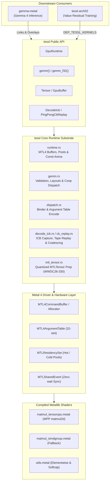
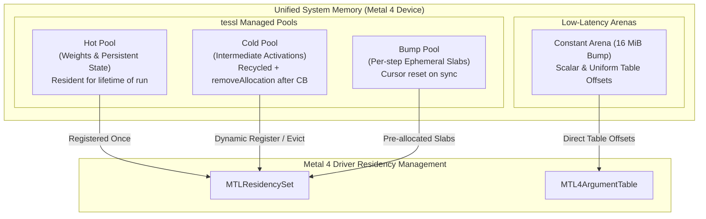
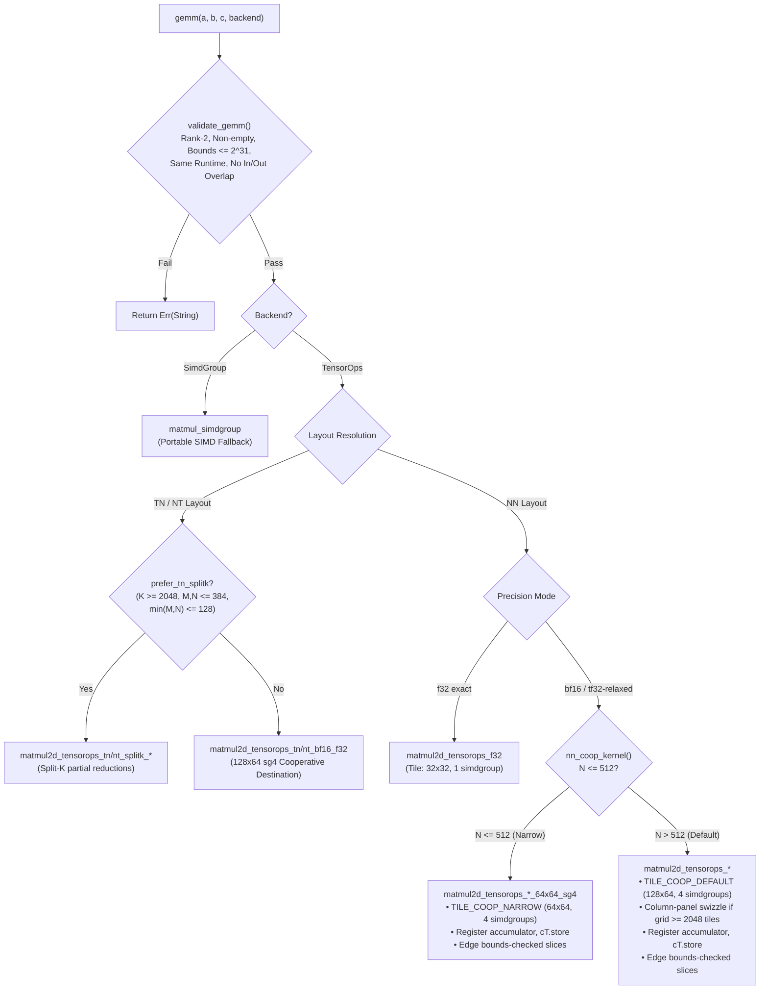
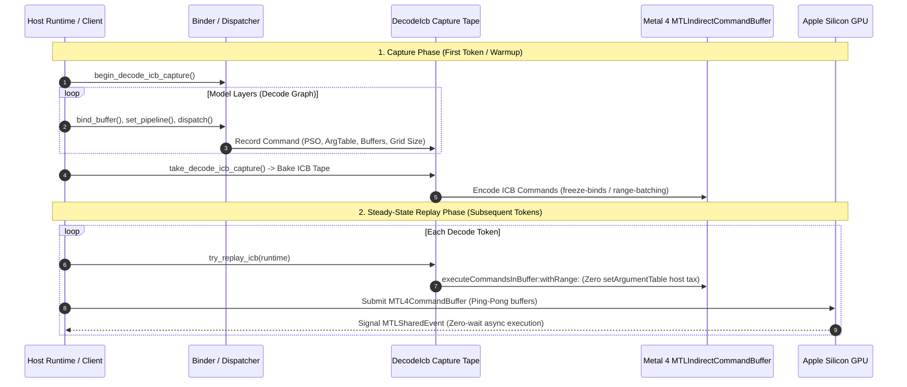

  <picture>
    <source media="(prefers-color-scheme: dark)" srcset="assets/png/logo-dark@900.png">
    
  </picture>

  <strong>Low-overhead, zero-host-wait Metal 4 GEMM and encode runtime for Apple silicon.</strong> 
  Powered by Metal Performance Primitives (MPP) TensorOps <code>matmul2d</code>.

---

`tessl` is a Rust GPU runtime substrate that executes high-performance matrix multiplication on Apple silicon through Metal 4 and Metal Performance Primitives (MPP) `matmul2d`, targeting the neural accelerators on Apple M-series hardware.

The name is short for *tessellation* — the design centers around how matrix operations are partitioned into tile geometries and the order in which those tiles are traversed.

---

## Key Highlights

- **Pure Metal 4 Architecture:** Built strictly on Metal 4 primitives (`MTL4CommandBuffer`, `MTL4ComputeCommandEncoder`, `MTL4ArgumentTable`, `MTLResidencySet`). Legacy `MTLCommandQueue` and command buffer paths are deliberately absent.
- **Hardware-Accelerated GEMM:** Direct integration with MPP TensorOps `matmul2d` across NN, TN, and NT layouts in `f32`, `bf16` (with `f32` accumulate), and `tf32-relaxed` precision modes.
- **Cooperative Register Accumulators:** High-throughput cooperative destination kernels (`get_destination_cooperative_tensor`) holding `f32` accumulators in GPU registers across the entire $K$-reduction, eliminating device memory round-trips for NN, TN, NT, and accumulating paths.
- **In-Kernel Grid Swizzling & Bounds Checking:** Column-panel tile swizzling for large grids ($\ge 2048$ tiles) bounding operand rereads, combined with origin-shifted slice bounds checking for ragged edges.
- **Zero-Wait Execution Pipeline:** Packed command encoding with bump-allocated constant arenas (16 MiB) and `MTLSharedEvent` synchronization—host threads never block mid-step.
- **Decode ICB Capture & Replay:** Low-latency Indirect Command Buffer (ICB) capture and ping-pong execution with freeze-binds and range-batching for decode-shaped inference workloads.

> [!IMPORTANT]
> **Platform Requirements:**
> - **OS:** macOS 26+
> - **Toolchain:** Xcode 26 with the Metal Toolchain component (`xcodebuild -downloadComponent MetalToolchain`).
> - **Hardware:** Apple Silicon GPU with Neural Accelerators (Apple M-series) for the MPP TensorOps path. A portable `simdgroup_matrix` fallback is available for A/B testing, but is 2–3× slower.

---

## System Architecture

---

## Performance vs. PyTorch MPS & MLX

Measurements taken on Apple M5 Pro utilizing `bench/paired_cross_runtime.py`. The benchmark harness interleaves `tessl` and PyTorch MPS iterations round-by-round to cancel GPU thermal throttling and frequency scaling drift (see [Benchmarking](docs/benchmarking.md)):

*Geomean of per-shape medians over 5 rounds across an 8-shape ladder:*

| Comparison | vs. Baseline | Worst Shape | Best Shape | Peak Throughput (M5 Pro) |
|---|---|---|---|---|
| **bf16 vs. PyTorch MPS bf16** | **1.11×** *(Outperforms MPS)* | 1.01× | 1.22× | **29,022 GFLOP/s** (`square_4096`) |
| **f32 exact vs. PyTorch MPS f32** | **1.07×** | 0.92× | 1.47× | **10,897 GFLOP/s** (`square_2048`) |
| **tf32-relaxed vs. PyTorch MPS f32** | **2.01×** | 1.49× | 2.90× | **18,040 GFLOP/s** (`square_4096`) |
| **bf16 vs. MLX bf16** | **2.63×** | 1.13× | 3.64× | — |

> [!WARNING]
> **Benchmarking Rigor:**
> - **Clock Drift:** Single-run cross-runtime benchmarks can fluctuate by 15–20% on identical workloads due to Apple Silicon dynamic power governor adjustments. Always use paired, interleaved sweeps (`bench_gemm_coop_ab` or `paired_cross_runtime.py`).
> - **Dispatch Floor:** Below ~2 GFLOP of total work, both runtimes hit a ~0.25 ms host submit-and-wait floor, measuring host driver dispatch latency rather than raw shader throughput.

---

## Metal 4 Memory & Residency Hierarchy

`tessl` manages GPU memory allocations explicitly to eliminate mid-command buffer host stalls and memory thrashing.

- **`BufferKind::Hot`**: Persistent allocations (model weights, optimizer state, KV cache banks). Added to the `MTLResidencySet` once at initialization and retained across steps.
- **`BufferKind::Cold`**: Intermediate activations. Managed via an active freelist pool with a default 2 GiB cap (`DEFAULT_POOL_CACHE_BYTES`). Unused slabs are evicted via `removeAllocation` upon command buffer completion.
- **`BufferKind::Bump`**: Ephemeral scratch memory allocated linearly from pre-committed slabs. Bump cursors are reset at synchronization points without individual buffer deallocations.
- **Constant Arena (16 MiB)**: Eliminates per-dispatch host allocation overhead for scalars and small metadata buffers by writing directly into a shared staging buffer at 16-byte aligned offsets.

---

## GEMM Pipeline & Cooperative Destination Execution

### Cooperative Destination Advantages

1. **Register Accumulation:** `op.template get_destination_cooperative_tensor<...>()` maintains the full `f32` accumulator in hardware SIMDgroup registers across the entire $K$-reduction loop.
2. **Zero Pre-Zero Overhead:** Register accumulators are initialized via `.set(i, 0.0f)` in shader code. The host-side `zero_f32(C)` pre-pass is completely eliminated.
3. **Single Store to Memory:** Device memory $C$ is written **exactly once** (`cT.store(tC)`) at threadgroup termination.
4. **Ragged Edge Handling:** Boundary tiles use origin-shifted full-extent tensor slices (`mA.slice(...)`, `mB.slice(...)`, `mC.slice(...)`), executing the same cooperative register accumulation without dropping tail elements.
5. **Column-Panel Grid Swizzling:** For large dispatch grids ($\text{tiles}_n \times \text{tiles}_m \ge 2048$), threadgroups are swizzled into 8-tile-row bands to bound operand $B$ cache rereads, delivering $+11\%$ throughput at $4096^3$.

---

## Indirect Command Buffer (ICB) Decode Pipeline

For auto-regressive generation where kernel execution times approach dispatch overheads, `tessl` provides Indirect Command Buffer (ICB) capture and tape replay.

---

## Documentation

| Document | Topic & Scope |
|---|---|
| [**Architecture**](docs/architecture.md) | Deep dive into kernel selection, cooperative destination register mechanics, $K$-reduction bandwidth analysis, and TN/NT layout optimizations. |
| [**Benchmarking**](docs/benchmarking.md) | The paired measurement protocol, GPU thermal and frequency scaling mitigation, and five measurement pitfalls. |
| [**Verification**](docs/verification.md) | Static tile geometry audit, self-asserting randomized shape fuzzing, and fault injection test suites. |

---

## Requirements

- **OS:** Apple Silicon, macOS 26 or newer
- **Toolchain:** Xcode 26 with the Metal Toolchain (`xcodebuild -downloadComponent MetalToolchain`)
- **Language:** Rust 1.82+

---

## License

Dual-licensed under either of:

- Apache License, Version 2.0 ([LICENSE-APACHE](LICENSE-APACHE))
- MIT License ([LICENSE-MIT](LICENSE-MIT))

at your option.
