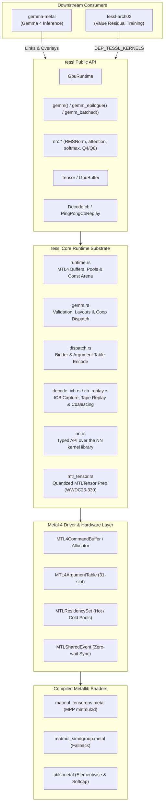
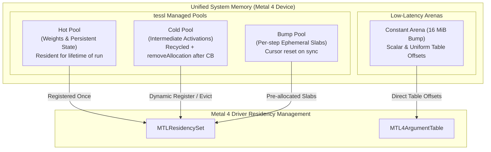
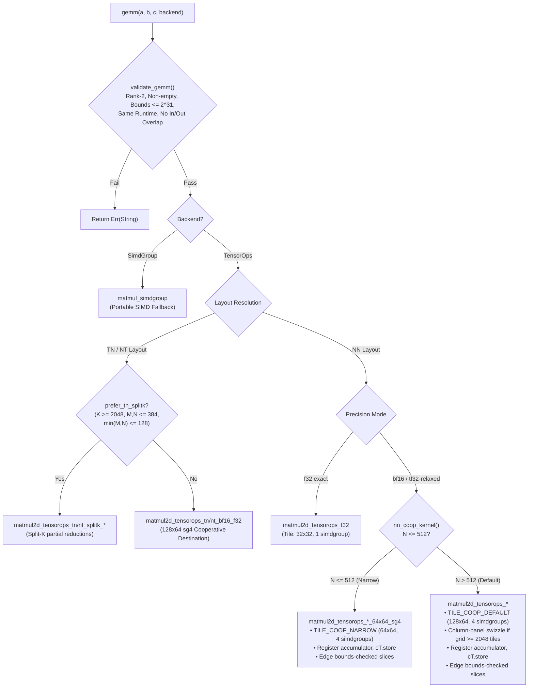
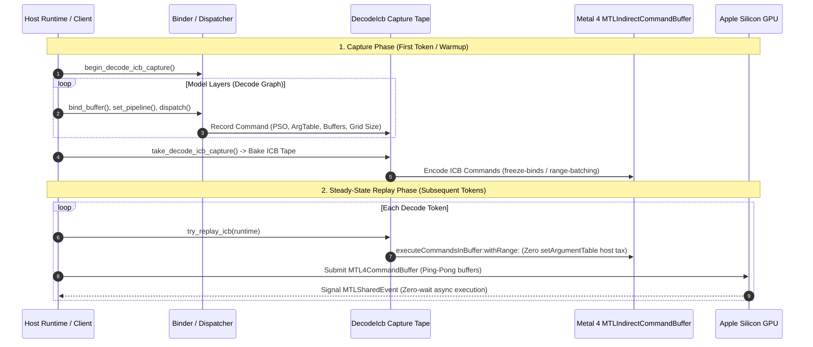

<p align="center">
  <picture>
    <source media="(prefers-color-scheme: dark)" srcset="assets/png/logo-dark@900.png">
    
  </picture>
</p>

<p align="center">
  <strong>Low-overhead, zero-host-wait Metal 4 GEMM and encode runtime for Apple silicon.</strong><br>
  Powered by Metal Performance Primitives (MPP) TensorOps <code>matmul2d</code>.
</p>

---

`tessl` is a Rust GPU runtime substrate that executes high-performance matrix multiplication on Apple silicon through Metal 4 and Metal Performance Primitives (MPP) `matmul2d`, targeting the neural accelerators on Apple M-series hardware.

The name is short for *tessellation* — the design centers around how matrix operations are partitioned into tile geometries and the order in which those tiles are traversed.

<p align="center">
  <a href="https://github.com/bharathvbcr/tessl/actions/workflows/ci.yml"></a>
</p>

| | |
| --- | --- |
| **Status** | `0.1.0` — Metal 4 / MPP TensorOps verified on M5 Pro |
| **Tests** | 199 passing, including doc tests (`cargo test --release -- --test-threads=1`) |
| **Platform** | Apple silicon, macOS 26+, Xcode 26 Metal Toolchain |
| **License** | MIT OR Apache-2.0 |

---

## Key Highlights

- **Pure Metal 4 Architecture:** Built strictly on Metal 4 primitives (`MTL4CommandBuffer`, `MTL4ComputeCommandEncoder`, `MTL4ArgumentTable`, `MTLResidencySet`). Legacy `MTLCommandQueue` and command buffer paths are deliberately absent.
- **Hardware-Accelerated GEMM:** Direct integration with MPP TensorOps `matmul2d` across NN, TN, and NT layouts in `f32`, `bf16` (with `f32` accumulate), and `tf32-relaxed` precision modes.
- **Cooperative Register Accumulators:** High-throughput cooperative destination kernels (`get_destination_cooperative_tensor`) holding `f32` accumulators in GPU registers across the entire $K$-reduction, eliminating device memory round-trips for NN, TN, NT, and accumulating paths.
- **In-Kernel Grid Swizzling & Bounds Checking:** Column-panel tile swizzling for large grids ($\ge 2048$ tiles) bounding operand rereads, combined with origin-shifted slice bounds checking for ragged edges.
- **Zero-Wait Execution Pipeline:** Packed command encoding with bump-allocated constant arenas (16 MiB) and `MTLSharedEvent` synchronization—host threads never block mid-step.
- **Neural-Network Kernel Library:** 18 Metal source files providing 72 kernel entry points — RMSNorm, gated MLP activations (SiLU / GELU-tanh), flash attention (sliding-window $h{=}128/256$, global $h{=}512$), fused RMSNorm+QKV+RoPE, MLX-format Q4 GEMV/GEMM, Q8 GEMV, KV-cache stores, embedding lookup, row-wise softmax/sum/max, and softcap sampling. All reachable through 62 shape-checked entry points in `tessl::nn`, not as raw pipeline-name strings.
- **Fused GEMM Epilogue:** `C = activation(alpha * A@B + beta * C_prev + bias)` in a single dispatch, applied while the accumulator is still in registers — measured 1.6–2.4× cheaper than the same work as a separate pass over $C$.
- **Mixed Precision & Quantization:** `f32`, `bf16`, `tf32-relaxed`, IEEE `binary16` (`DType::F16`), and an exact `int8 x int8 -> int32` GEMM with fused per-column dequantization (`nn::gemm_i8_dequant`).
- **Strided Batched GEMM:** `gemm_batched` with explicit per-operand batch strides, so a batch dimension is expressed rather than inferred from a rank-2 shape.
- **Decode ICB Capture & Replay:** Low-latency Indirect Command Buffer (ICB) capture and ping-pong execution with freeze-binds and range-batching for decode-shaped inference workloads.

> [!IMPORTANT]
> **Platform Requirements:**
> - **OS:** macOS 26+
> - **Toolchain:** Xcode 26 with the Metal Toolchain component (`xcodebuild -downloadComponent MetalToolchain`).
> - **Hardware:** Apple Silicon GPU with Neural Accelerators (Apple M-series) for the MPP TensorOps path. A portable `simdgroup_matrix` fallback is available for A/B testing, but is 2–3× slower.

---

## System Architecture



---

## Performance vs. PyTorch MPS & MLX

Measurements taken on Apple M5 Pro utilizing `bench/paired_cross_runtime.py`. The benchmark harness interleaves `tessl` and PyTorch MPS iterations round-by-round to cancel GPU thermal throttling and frequency scaling drift (see [Benchmarking](docs/benchmarking.md)):

*Geomean of per-shape medians over 5 rounds across an 8-shape ladder:*

| Comparison | vs. Baseline | Worst Shape | Best Shape | Peak Throughput (M5 Pro) |
|---|---|---|---|---|
| **bf16 vs. PyTorch MPS bf16** | **1.11×** *(Outperforms MPS)* | 1.01× | 1.22× | **29,022 GFLOP/s** (`square_4096`) |
| **f32 exact vs. PyTorch MPS f32** | **1.07×** | 0.92× | 1.47× | **10,897 GFLOP/s** (`square_2048`) |
| **tf32-relaxed vs. PyTorch MPS f32** | **2.01×** | 1.49× | 2.90× | **18,040 GFLOP/s** (`square_4096`) |
| **bf16 vs. MLX bf16** | **2.63×** | 1.13× | 3.64× | — |

> [!WARNING]
> **Benchmarking Rigor:**
> - **Clock Drift:** Single-run cross-runtime benchmarks can fluctuate by 15–20% on identical workloads due to Apple Silicon dynamic power governor adjustments. Always use paired, interleaved sweeps (`bench_gemm_coop_ab` or `paired_cross_runtime.py`).
> - **Dispatch Floor:** Below ~2 GFLOP of total work, both runtimes hit a ~0.25 ms host submit-and-wait floor, measuring host driver dispatch latency rather than raw shader throughput.

---

## Metal 4 Memory & Residency Hierarchy

`tessl` manages GPU memory allocations explicitly to eliminate mid-command buffer host stalls and memory thrashing.



- **`BufferKind::Hot`**: Persistent allocations (model weights, optimizer state, KV cache banks). Added to the `MTLResidencySet` once at initialization and retained across steps.
- **`BufferKind::Cold`**: Intermediate activations. Managed via an active freelist pool with a default 2 GiB cap (`DEFAULT_POOL_CACHE_BYTES`). Unused slabs are evicted via `removeAllocation` upon command buffer completion.
- **`BufferKind::Bump`**: Ephemeral scratch memory allocated linearly from pre-committed slabs. Bump cursors are reset at synchronization points without individual buffer deallocations.
- **Constant Arena (16 MiB)**: Eliminates per-dispatch host allocation overhead for scalars and small metadata buffers by writing directly into a shared staging buffer at 16-byte aligned offsets.

---

## GEMM Pipeline & Cooperative Destination Execution



### Cooperative Destination Advantages

1. **Register Accumulation:** `op.template get_destination_cooperative_tensor<...>()` maintains the full `f32` accumulator in hardware SIMDgroup registers across the entire $K$-reduction loop.
2. **Zero Pre-Zero Overhead:** Register accumulators are initialized via `.set(i, 0.0f)` in shader code. The host-side `zero_f32(C)` pre-pass is completely eliminated.
3. **Single Store to Memory:** Device memory $C$ is written **exactly once** (`cT.store(tC)`) at threadgroup termination.
4. **Ragged Edge Handling:** Boundary tiles use origin-shifted full-extent tensor slices (`mA.slice(...)`, `mB.slice(...)`, `mC.slice(...)`), executing the same cooperative register accumulation without dropping tail elements.
5. **Column-Panel Grid Swizzling:** For large dispatch grids ($\text{tiles}_n \times \text{tiles}_m \ge 2048$), threadgroups are swizzled into 8-tile-row bands to bound operand $B$ cache rereads, delivering $+11\%$ throughput at $4096^3$.

---

## Indirect Command Buffer (ICB) Decode Pipeline

For auto-regressive generation where kernel execution times approach dispatch overheads, `tessl` provides Indirect Command Buffer (ICB) capture and tape replay.



---

## Quickstart

```bash
cargo add tessl
```

Both snippets below are compiled and run as examples, so they cannot drift from
the API:

```bash
cargo run --release --example gemm      # the GEMM quickstart
cargo run --release --example nn_layer  # RMSNorm -> gate/up -> GELU -> residual
```

### Basic GEMM

```rust
use tessl::{gemm, GemmBackend, GpuRuntime};

fn main() -> Result<(), Box<dyn std::error::Error>> {
    let rt = GpuRuntime::new()?;

    let a = rt.alloc_tensor_f32(&[4096, 2304])?;
    let b = rt.alloc_tensor_f32(&[2304, 768])?;
    let c = rt.alloc_tensor_f32(&[4096, 768])?;

    gemm(&a, &b, &c, GemmBackend::TensorOps)?;   // C = A @ B via MPP TensorOps
    rt.synchronize()?;
    Ok(())
}
```

### Consuming kernels from a downstream crate

`tessl` sets `links = "tessl"` and exports `DEP_TESSL_KERNELS`, so a crate that
compiles its own metallib can build against the canonical kernel sources rather
than keeping a copy that silently drifts. In a downstream `build.rs`:

```rust
let tessl_kernels = std::path::PathBuf::from(std::env::var("DEP_TESSL_KERNELS").unwrap());
let matmul_shader = tessl_kernels.join("matmul_tensorops.metal");
// ... compile matmul_shader into your own metallib
```

To overlay a custom metallib at runtime:

```rust
use std::path::Path;

let rt = GpuRuntime::from_metallib_path(Path::new("/path/to/custom.metallib"))?;

// Or overlay onto tessl's default library. Pipeline names must be unique across
// the primary library and every overlay: `pipeline()` resolves the primary
// first, so a duplicate name in an overlay is silently unreachable.
let rt = GpuRuntime::new()?;
rt.add_metallib(Path::new("/path/to/custom_overlay.metallib"))?;
```

---

## Neural-Network Kernels

Every kernel is reached through a typed, shape-checked function in `tessl::nn`.
None of them require the caller to name a pipeline string or hand-compute a
threadgroup grid.

| Group | Entry points | Notes |
|---|---|---|
| Normalization | `rms_norm_f32` | Fused weight multiply; `eps` applied inside the kernel. |
| MLP | `mlp_silu`, `mlp_gelu_tanh`, `gate_up_*` | `GeluTanh` uses a clamped `precise::tanh`; plain `tanh` lowers to `air.fast_tanh` at `-O2` and returns NaN past roughly \|10\|. |
| Attention | `flash_attn_swa_h128/h256`, `flash_attn_global_h512` | Sliding-window and global variants, selected by `AttnHeadDim`. |
| Fused prologue | `rms_qkv_rope` | RMSNorm → QKV projection → RoPE in one dispatch. |
| Reductions | `softmax_rows_f32`, `row_sum_f32`, `row_max_f32` | Max-subtracted softmax; a fully masked row returns uniform, not NaN. |
| Quantized | `Q4Bank`, `Q4MlxBank`, `gemv_q8`, `gemm_i8_dequant` | Both the signed-int4 and the MLX unsigned-affine conventions. |
| Cache / IO | `kv_store`, `embed_lookup`, `softcap_sample` | |

Argument validation is not advisory. Every entry point checks buffer capacity
and dimension products before encoding anything, and returns `Err` without
dispatching — `tests/nn_adversarial.rs` asserts all three properties (error
returned, no panic, dispatch count still zero) across the whole surface.

---

## Fused GEMM Epilogue

`gemm_epilogue` computes `C = activation(alpha * A@B + beta * C_prev + bias)` in
one dispatch.

Every term there is otherwise a separate kernel that reads all of `C` and writes
all of `C`. A bias plus an activation costs two extra full round-trips through
device memory — on a bandwidth-bound machine, most of what the GEMM saved.
Applied inside the cooperative-destination kernel the accumulator is still in
registers, so `C` is written exactly once and read at most once, only when
`beta != 0`.

```rust
use tessl::{gemm_epilogue, Activation, Epilogue, GemmBackend};

gemm_epilogue(&a, &b, &c, GemmBackend::TensorOps, Epilogue {
    alpha: 1.0,
    beta: 0.0,                 // skips reading C entirely
    bias: Some(&bias),         // per-column, length N
    activation: Activation::GeluTanh,
})?;
```

Bias is per-column and broadcasts across rows through a **row-stride-0 tensor
view**, so the same cooperative `load` that fetches `C_prev` fetches the bias
with no separate indexing.

| Shape | `gemm` | Fused | `gemm` + one pass over C | Epilogue cost | vs. one pass |
|---|---:|---:|---:|---:|---:|
| 512³ | 0.377 ms | 0.558 ms | 0.661 ms | 0.181 ms | **1.57× cheaper** |
| 1024³ | 0.471 ms | 0.584 ms | 0.746 ms | 0.113 ms | **2.43× cheaper** |
| 2048×2048×512 | 0.916 ms | 1.139 ms | 1.297 ms | 0.223 ms | **1.71× cheaper** |

`cargo run --release --example epilogue_cost`. The comparison arm is `gemm` plus
a *single* `add_inplace_f32` sweep — strictly less work than a real bias
broadcast, and half the work of bias plus a separate activation. Fusing beats
even that lower bound at every shape. All three arms are GPU-side in one
interleaved run, so machine load during measurement affects them alike.

It requires the cooperative-destination path — bf16 operands, or f32 with
relaxed precision. The exact-f32 and simdgroup kernels write `C` straight from
the matmul with no register accumulator, so there is nothing to fuse into; those
are refused rather than silently falling back to separate dispatches, which
would make the call quietly slower than the unfused code it replaced.

---

## Verification

```bash
# Full suite. GPU tests are not thread-safe across concurrent OS threads
# sharing default command encoders, so --test-threads=1 is required.
cargo test --release -- --test-threads=1

# Validate static TileGeom definitions against compiled Metal kernel constants
python3 scripts/audit_gemm_tiles.py

# Quick shape fuzz (160 cases) runs as part of the ordinary suite:
cargo test --release --lib -- --test-threads=1 --nocapture gemm_fuzz_quick

# Deep soak (2500 cases), #[ignore]d so it stays out of the default run:
cargo test --release --lib -- --ignored --test-threads=1 --nocapture gemm_fuzz_deep

# Replay a specific failing seed:
STRESS_SEED=0xdeadbeef cargo test --release --lib -- --test-threads=1 gemm_fuzz_quick
```

**Static tile audit** (`scripts/audit_gemm_tiles.py`) cross-references every Rust
`TileGeom` struct against the `constexpr int SM/SN` parameters compiled into
`matmul_tensorops.metal`, including macro-instantiated kernels
(`NN_COOP_KERNEL`, `TN_NT_COOP_KERNEL`). A mismatch would make the host dispatch
incorrect threadgroup grids, silently leaving output tiles unwritten.

**Shape fuzzer** `gemm_fuzz_quick` / `gemm_fuzz_deep` check numerical correctness
across non-standard dimensions, reporting the failing seed for replay via
`STRESS_SEED`.

> [!NOTE]
> An earlier version of this section claimed the fuzzer "asserts its own
> coverage — the test panics if any selectable NN kernel is exercised in fewer
> than 1% of fuzz iterations". No such assertion is implemented. It named a test
> (`gemm_randomized_shape_fuzz`) and environment variables (`GEMM_FUZZ_SEED`,
> `GEMM_FUZZ_CASES`) that do not exist either, so the documented command ran zero
> tests and reported success. Per-kernel coverage accounting would be worth
> adding; until it is, the fuzzer checks correctness on the shapes it happens to
> draw and nothing more.

---

## Benchmarking & Tuning Binaries

Tuning and A/B measurement kernels (92 variants) are excluded from the default
metallib to keep release binaries light (0.20 MB vs. 1.07 MB):

```bash
TESSL_GEMM_TUNE=1 cargo build --release --bins
```

| Binary | Purpose |
|---|---|
| `bench_gemm_tile_tune` | Exhaustive tile geometry ($SM \times SN$) and $BK$ ladder benchmark. |
| `bench_gemm_tnnt_tune` | TN/NT tile sweep; the paired, round-interleaved A/B comparison lane. |
| `bench_gemm_sweep` | Cross-runtime sweep (`f32`, `tf32`, `bf16`) with JSON telemetry output. |
| `probe_gemm_parity` | Bit-exact verification probe comparing TensorOps against the reference SIMD path. |
| `bench/paired_cross_runtime.py` | Python harness driving paired `tessl` vs. PyTorch MPS / MLX evaluation. |

---

## Environment Variables

All runtime configuration uses the canonical `TESSL_*` prefix. Legacy
`METAL_RUNTIME_*` and `METAL_NATIVE_*` variants are still accepted.

| Variable | Default | Description |
|---|---|---|
| `TESSL_GEMM_TUNE` | `0` | Compiles the 92-kernel A/B tuning suite into the metallib (build-time). |
| `TESSL_GEMM_ACCUM` | `0` | Enables native TensorOps `multiply_accumulate` for TN/NT accumulate paths. |
| `TESSL_GEMM_ACCUM_DX` | `0` | Enables the hardware accumulate path specifically for $dX$ NT GEMM. |
| `TESSL_GEMM_INTERIOR` | `0` | Enables interior-offset tile optimizations for `f32` GEMM. |
| `TESSL_HAZARD_BARRIERS` | `0` (barriers on) | **Unsafe, do not enable.** `1` *removes* the always-on Dispatch→Dispatch device barrier. The sense is the opposite of what this row said until 2026-08-31, and following the old wording to "enforce barriers" removed them. Enabling it requires the caller to place an explicit `Binder::barrier` at every RAW edge, and tessl's own ops do not: measured on an M5 Pro, `gemm_tn_accum_train` 64×64×128 under async encode produced wrong results in **300 of 300** repetitions with this set. |
| `TESSL_COARSE_BARRIERS` | inherits `TESSL_HAZARD_BARRIERS` | Replaces per-RAW barriers with coarse phase-level synchronization. |
| `TESSL_MID_COMMIT=N` | `0` | Overlaps host command encoding with GPU execution every $N$ dispatches. |
| `TESSL_DECODE_ICB` | `0` | Enables the Indirect Command Buffer capture and execution path. |
| `TESSL_ICB_FREEZE_BINDS` | `0` | Freezes argument table buffer bindings directly into ICB commands. |
| `TESSL_ICB_RANGE_BATCH` | `0` | Coalesces contiguous ICB command ranges into single execution dispatches. |
| `TESSL_SKIP_AOT` | `0` | Bypasses the `build.rs` AOT shader compile and reuses an existing `default.metallib`. Panics if that file is absent rather than baking a path that fails at every `GpuRuntime::new()`. |

---

## Feature Flags

| Feature | Default | Description |
|---|---|---|
| `quant-prep` | **Disabled** | Compiles `mtl_tensor` for native quantized `MTLTensor` bindings (WWDC26-330). Off by default because it is exactly that — prep: `try_quant_tensorops_prefill_gemm` returns an error and nothing calls it. Kept compiling behind a flag rather than shipped as public API that does not work. |

---

## Documentation

| Document | Topic & Scope |
|---|---|
| [**Architecture**](docs/architecture.md) | Deep dive into kernel selection, cooperative destination register mechanics, $K$-reduction bandwidth analysis, and TN/NT layout optimizations. |
| [**Benchmarking**](docs/benchmarking.md) | The paired measurement protocol, GPU thermal and frequency scaling mitigation, and five measurement pitfalls. |
| [**Verification**](docs/verification.md) | Static tile geometry audit, randomized shape fuzzing, and fault injection test suites. |
| [**Tuning log**](bench/results/bf16_tile_tune_FINDINGS.md) | Empirical $BK$ ladder benchmarks, root causes, and the landed M5 Pro speedups. |
| [**Changelog**](CHANGELOG.md) | Release history. |

---

## Known Gaps

Recorded rather than implied. Every kernel is wired to a typed Rust API, the
suite is warning-free, and there are no stubs; these are capabilities the crate
does not have.

| Gap | Why it matters | Why not yet |
|---|---|---|
| **Int4 TensorOps GEMM** | Half the weight bandwidth of int8. | TensorOps itself accepts `int4b_format` — the block is the shader-side tensor constructor for a sub-byte element type, not the objc2 binding this table used to blame. `nn::gemm_i8_dequant` ships the int8 case. |
| **No CPU fallback** | Without a Metal 4 device, nothing runs. | Deliberate. This is an Apple-silicon runtime, and a silent CPU path would make every "GPU" benchmark here meaningless. |
| **GPU CI on hosted runners** | Whether the suite runs unattended, or only on hardware I own. | Measured, not assumed: it does not. On `macos-26` the Metal Toolchain installs and all 18 kernel sources compile and lint — the `check` job does exactly that every push — but the device probe fails, so the shaders build there and cannot execute. The suite therefore runs on a gated self-hosted M5 runner. CI covers build, clippy, rustdoc and the static tile audit on every push; the 199 tests do not run unattended. |
| **Benchmark numbers in CI** | The GFLOP/s figures above are reproducible only by hand. | Hosted runners are virtualised and shared, so a timing from one describes the runner. The `bench` job runs the sweep on bare-metal Apple silicon and is gated behind a repository variable until such a runner is registered. |

---

## Requirements

- **OS:** Apple Silicon, macOS 26 or newer
- **Toolchain:** Xcode 26 with the Metal Toolchain (`xcodebuild -downloadComponent MetalToolchain`)
- **Language:** Rust 1.82+

---

## License

Dual-licensed under either of:

- Apache License, Version 2.0 ([LICENSE-APACHE](LICENSE-APACHE))
- MIT License ([LICENSE-MIT](LICENSE-MIT))

at your option.
