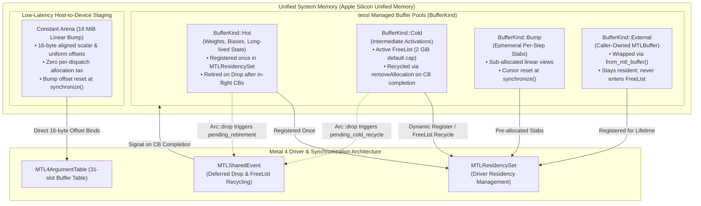
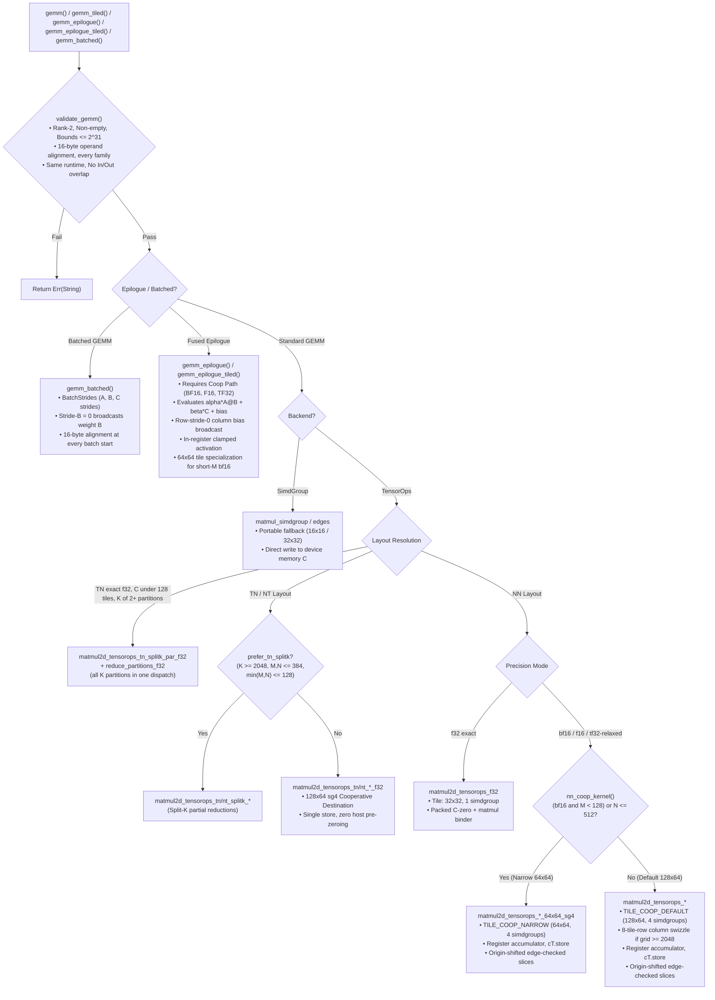

<p align="center">
  <picture>
    <source media="(prefers-color-scheme: dark)" srcset="assets/png/logo-dark@900.png">
    
  </picture>
</p>

<p align="center">
  <strong>Low-overhead, zero-host-wait Metal 4 GEMM and encode runtime for Apple silicon.</strong><br>
  Powered by Metal Performance Primitives (MPP) TensorOps <code>matmul2d</code>.
</p>

---

`tessl` is a Rust GPU runtime substrate that executes high-performance matrix multiplication on Apple silicon through Metal 4 and Metal Performance Primitives (MPP) `matmul2d`, targeting the neural accelerators on Apple M-series hardware.

The name is short for *tessellation* — the design centers around how matrix operations are partitioned into tile geometries and the order in which those tiles are traversed.

<p align="center">
  <a href="https://tessl.vbcr.dev/"></a>
  <a href="https://crates.io/crates/tessl"></a>
  <a href="https://docs.rs/tessl"></a>
  <a href="https://github.com/bharathvbcr/tessl/actions/workflows/ci.yml"></a>
  <a href="#license"></a>
</p>

<p align="center">
  <a href="https://tessl.vbcr.dev/"><strong>Live Interactive Benchmark Showcase (tessl.vbcr.dev)</strong></a> ·
  <a href="https://docs.rs/tessl"><strong>API documentation</strong></a> ·
  <a href="https://crates.io/crates/tessl"><strong>crates.io</strong></a> ·
  <a href="docs/architecture.md">Architecture</a> ·
  <a href="docs/benchmarking.md">Benchmarking</a> ·
  <a href="docs/verification.md">Verification</a>
</p>

| | |
| --- | --- |
| **Status** | [`0.2.0`](https://crates.io/crates/tessl) — Metal 4 / MPP TensorOps verified on M5 Pro |
| **API docs** | [docs.rs/tessl](https://docs.rs/tessl) — built on `aarch64-apple-darwin` with all features |
| **Tests** | 530 `#[test]` functions across 50 integration files and the library, plus doc tests (`cargo test --release -- --test-threads=1`; the GPU suite needs an M-series Mac) |
| **Kernel coverage** | All 44 promoted kernels have a numeric test, not only a name check |
| **Platform** | Apple silicon, macOS 26+, Xcode 26 Metal Toolchain |
| **License** | MIT OR Apache-2.0 |

---

## Key Highlights

- **Pure Metal 4 Architecture:** Built strictly on Metal 4 primitives (`MTL4CommandBuffer`, `MTL4ComputeCommandEncoder`, `MTL4ArgumentTable`, `MTLResidencySet`). Legacy `MTLCommandQueue` and command buffer paths are deliberately absent.
- **Hardware-Accelerated GEMM:** Direct integration with MPP TensorOps `matmul2d` across NN, TN, and NT layouts in `f32`, `bf16` (with `f32` accumulate), and `tf32-relaxed` precision modes.
- **Cooperative Register Accumulators:** High-throughput cooperative destination kernels (`get_destination_cooperative_tensor`) holding `f32` accumulators in GPU registers across the entire $K$-reduction, eliminating device memory round-trips for NN, TN, NT, and accumulating paths.
- **In-Kernel Grid Swizzling & Bounds Checking:** Column-panel tile swizzling bounding operand rereads (on large grids, $\ge 2048$ tiles, in the coop NN kernel; once $B$ holds $\ge 2^{23}$ elements in the exact-f32, bf16 TN/NT and int8 kernels), combined with origin-shifted slice bounds checking for ragged edges.
- **Zero-Wait Execution Pipeline:** Packed command encoding with bump-allocated constant arenas (16 MiB) and `MTLSharedEvent` synchronization—host threads never block mid-step.
- **Neural-Network Kernel Library:** 35 Metal source files providing 251 kernel entry points — RMSNorm, gated MLP activations (SiLU / GELU-tanh), flash attention (sliding-window $h{=}128/256$, global $h{=}512$), fused RMSNorm+QKV+RoPE, MLX-format Q4 GEMV/GEMM, Q8 GEMV, KV-cache stores, embedding lookup, row-wise softmax/sum/max, and softcap sampling. All reachable through 86 shape-checked entry points in `tessl::nn`, not as raw pipeline-name strings.
- **Qwen3.5 Layer Kernels (`tessl::qwen35`):** the gated delta net as two fused dispatches (a parallel per-chunk prep with the 64×64 triangular solve in threadgroup memory, then a sequential `simdgroup_matrix` scan), a snapshot-reading recurrent decode, shared-prefix attention (one KV prefix at batch stride 0 for many questions), causal conv+SiLU, gated RMSNorm, Qwen's partial RoPE and output gate, and scoring of only the answer rows — see [docs/qwen35.md](docs/qwen35.md). Checked against transformers' own Qwen3.5 code on a CPU emulator of the kernels and compiled by Apple's Metal compiler in CI (`-std=metal4.0 -Werror`), and tested on the M5 Pro GPU (`tests/qwen35_kernels.rs`); per-kernel, forward and `train_step` timings on the M5 Pro are in the same document.
- **Qwen3.5 Training on the GPU (`tessl::qwen35_train`, `qwen35_bwd`, `gdn_train`, `attn_train`, `cross_entropy`):** one full training step of the Qwen3.5 text model — forward with per-layer recompute, causal-LM loss, and every parameter's gradient — without leaving Metal. The gated delta rule saves one state per 64 tokens (32 MiB/layer at the 2B's shapes, T = 2048, versus 435 MiB in torch); the LM-head cross-entropy runs in vocabulary chunks and never forms `[rows, vocab]` logits; every weight gradient is a per-block partial summed in order, so a step is deterministic with no atomics. A step can also be split in two halves for a loss computed outside tessl, accumulated into a gradient bank, and scored only at chosen positions. Measured against transformers' own f32 reference in [docs/qwen35.md](docs/qwen35.md).
- **EmbeddingGemma 2 Encoder (`tessl::embedgemma2`):** the `google/embeddinggemma-2` text path from its own checkpoint — bidirectional attention with a symmetric sliding window and per-sequence lengths, per-layer inputs, row-range mean pooling, and Matryoshka prefixes (`encode`'s `truncate_dim`) normalized on the GPU — with ragged batches split into length-sorted forwards. See [EmbeddingGemma 2](docs/embedgemma2.md).
- **Device AdamW (`tessl::qwen35_adamw`):** `adamw_step` on any f32 tensor, and `Qwen35Model::adamw_step` over the model's own parameters in place — packed windows included — with `clip_grad_norm_`-style clipping and checkpoint/restore of the moments and step count. Params, gradients and both moments for the 2B come to 32 GB, which is what lets it fit a 64 GB Mac.
- **bf16 Operands per Call (`GemmOperands`):** `gemm_bf16`, `gemm_tn_bf16`, `gemm_nt_bf16` and `qwen35_train` / `cross_entropy` options choose bf16 operands (f32 accumulate) for one call without changing the model's f32 storage; the 2B `train_step` on bf16 operands measures 2.44× the exact step at T = 2048.
- **C ABI and torch binding (`src/capi.rs`, `python/tessl_torch`):** `libtessl.dylib` exposes the training path at ABI version 9 — cross-entropy, `chunk_gated_delta_rule` at transformers' own seam (`patch_transformers_qwen3_5()`), `Qwen35.train_step`, the two-phase step, the gradient bank and AdamW — so a torch loop can call into tessl. See [python/README.md](python/README.md).
- **Embedded Metallib:** `GpuRuntime::new` loads the shader library from bytes included at compile time (`newLibraryWithData`), so a binary no longer depends on the build directory's `.metallib` still existing. `add_metallib_bytes` is the same load for an overlay.
- **Fused GEMM Epilogue:** `C = activation(alpha * A@B + beta * C_prev + bias)` in a single dispatch, applied while the accumulator is still in registers — measured 1.6–2.4× cheaper than the same work as a separate pass over $C$.
- **Mixed Precision & Quantization:** `f32`, `bf16`, `tf32-relaxed`, IEEE `binary16` (`DType::F16`), and an exact `int8 x int8 -> int32` GEMM with fused per-column dequantization (`nn::gemm_i8_dequant`).
- **Strided Batched GEMM:** `gemm_batched` with explicit per-operand batch strides, so a batch dimension is expressed rather than inferred from a rank-2 shape.
- **Decode ICB Capture & Replay:** Low-latency Indirect Command Buffer (ICB) capture and ping-pong execution with freeze-binds and range-batching for decode-shaped inference workloads.

> [!IMPORTANT]
> **Platform Requirements:**
> - **OS:** macOS 26+
> - **Toolchain:** Xcode 26 with the Metal Toolchain component (`xcodebuild -downloadComponent MetalToolchain`).
> - **Hardware:** Apple Silicon GPU with Neural Accelerators (Apple M-series) for the MPP TensorOps path. A portable `simdgroup_matrix` fallback is available for A/B testing, but is 2–3× slower.

---

## System Architecture


```mermaid
flowchart TD
    subgraph Downstream["Downstream Consumers & Ecosystem"]
        Gemma["gemma-metal<br/>(LLM Inference Runtime)"]
        Arch02["tessl-arch02<br/>(Value Residual Training)"]
        CustomApp["Custom Overlays & Pipelines<br/>(links = 'tessl', DEP_TESSL_KERNELS)"]
    end

    subgraph TesslAPI["tessl Public API Surface"]
        GpuRt["GpuRuntime<br/>(Device, Allocator, Encoder Lease)"]
        GemmAPI["GEMM Suite<br/>gemm() · gemm_epilogue() · gemm_batched()"]
        NnAPI["tessl::nn (62 Typed Entry Points)<br/>RMSNorm · FlashAttn · Softmax · Q4/Q8 GEMV"]
        TensorTypes["Tensor &lt;T&gt; / GpuBuffer<br/>(DType: F32, BF16, F16, I8, I32)"]
        IcbAPI["DecodeIcb &amp; PingPongCbReplay<br/>(ICB Capture &amp; Dual-Slot Replay)"]
    end

    subgraph CoreEngine["tessl Core Runtime Engine"]
        RuntimeMod["runtime.rs<br/>• MTL4 Buffers, FreeList Pools, Bump Arena<br/>• 16 MiB Constant Arena (Scalar Binds)<br/>• Deferred Recycle on MTLSharedEvent"]
        GemmMod["gemm.rs<br/>• Rank-2 Extent &amp; Alignment Validation<br/>• Layout Resolution (NN, TN, NT, Batched)<br/>• Coop Destination (128x64 &amp; 64x64 sg4)<br/>• Short-M bf16 &amp; Epilogue Tile Specialization"]
        DispatchMod["dispatch.rs<br/>• Binder &amp; 31-slot MTL4ArgumentTable<br/>• Threadgroup Grid Geometry Helpers"]
        NnMod["nn.rs<br/>• Checked elems() &amp; require::&lt;T&gt; Bounds<br/>• _with_scalars Binding Seam"]
        IcbMod["decode_icb.rs &amp; cb_replay.rs<br/>• Capture Tape, Freeze-Binds &amp; Range-Batching<br/>• Dual-Slot Ping-Pong State Machine"]
        MtlTensorMod["mtl_tensor.rs<br/>• Quantized MTLTensor Prep (WWDC26-330)"]
    end

    subgraph Metal4Driver["Metal 4 Driver &amp; Hardware Abstraction Layer"]
        CmdBuf["MTL4CommandBuffer &amp; CommandAllocator"]
        ComputeEnc["MTL4ComputeCommandEncoder<br/>(Packed with_binder encoding)"]
        ArgTable["MTL4ArgumentTable (31 Buffer Slots)"]
        ResSet["MTLResidencySet (Hot, Cold, Bump, External)"]
        SharedEvt["MTLSharedEvent (Zero-Host-Wait Synchronization)"]
    end

    subgraph MetallibShaders["Compiled Metallib Shader Kernels"]
        TensorOps["matmul_tensorops.metal<br/>(MPP TensorOps matmul2d · Register Accumulation)"]
        SimdFallback["matmul_simdgroup.metal<br/>(Portable SIMDgroup Matrix Fallback)"]
        NnKernels["30 Kernel Sources (202 Entry Points)<br/>RMSNorm · FlashAttn SWA/Global · MLX Q4/Q8 · RoPE · Qwen3.5 fwd/bwd · AdamW"]
    end

    Downstream -->|Typed API Calls| TesslAPI
    TesslAPI --> CoreEngine
    CoreEngine --> Metal4Driver
    Metal4Driver --> MetallibShaders
```

---

## Performance vs. PyTorch MPS & MLX

Apple M5 Pro, `python3 bench/paired_cross_runtime.py --rounds 5 --lanes torch,mlx`
against torch 2.13 (MPS) and MLX, re-measured 2026-09-01. The harness interleaves
`tessl` and the baseline round by round so thermal throttling and frequency
scaling hit both lanes alike — see [Benchmarking](docs/benchmarking.md).

*Geomean of per-shape medians over 5 rounds across an 8-shape ladder:*

| Comparison | Geomean | Worst shape | Best shape | Shapes below 1.0 |
|---|---|---|---|---|
| **bf16 vs. PyTorch MPS bf16** | **1.03×** | 0.86× | 1.16× | **4 of 8** |
| **f32 exact vs. PyTorch MPS f32** | **1.12×** | 0.87× | 1.78× | 2 of 8 |
| **tf32-relaxed vs. PyTorch MPS f32** | **2.11×** | 1.76× | 2.45× | 0 of 8 |
| **bf16 vs. MLX bf16** | **2.55×** | 1.12× | 3.67× | 0 of 8 |

> [!IMPORTANT]
> **bf16 against MPS is parity, not a win.** An earlier version of this table
> claimed 1.11× with a worst shape of 1.01×, which reads as "never loses". Re-run
> with the same harness it is 1.03× and it loses on half the ladder, by as much as
> 0.86× at 8192×3072×768. The number that is worth something is the **tf32 lane at
> 2.11×**, which wins on every shape — and the MLX comparison at 2.55×, also clean.
> Apple's own bf16 GEMM is well tuned; matching it is the honest claim.

Peak observed throughput, `cargo run --release --bin bench_gemm_sweep`, medians
over 50 iterations after 10 warmup:

| Precision | Peak | Shape |
|---|---:|---|
| bf16 | **26,642 GFLOP/s** | `square_4096` |
| tf32-relaxed | 16,293 GFLOP/s | `mlp_up` |
| f32 exact | 6,431 GFLOP/s | `square_2048` |

> [!WARNING]
> **Benchmarking rigor.**
> - **Clock drift.** Single-run cross-runtime numbers fluctuate 15–20% on identical
>   work as the power governor moves. Use the paired sweep
>   (`bench/paired_cross_runtime.py`); for kernel-vs-kernel A/B use
>   `bench_gemm_tile_tune` or `bench_gemm_tnnt_tune` behind `TESSL_GEMM_TUNE=1`.
> - **Dispatch floor.** Below ~2 GFLOP of total work both runtimes sit on a
>   ~0.25 ms host submit-and-wait floor, which measures driver dispatch latency
>   rather than shader throughput.
> - **These figures are reproducible, and were reproduced.** The f32 and tf32
>   peaks previously published here (10,897 and 18,040 GFLOP/s) are not: the
>   crate's own committed sweep in `bench/results/` records 6,606 for f32, and a
>   fresh run gives 6,431. Two independent sources agreeing against a third is
>   why they were replaced rather than averaged.

---

## Metal 4 Memory & Residency Hierarchy

`tessl` manages GPU memory allocations explicitly to eliminate mid-command buffer host stalls and memory thrashing.


```mermaid
flowchart TD
    subgraph UnifiedMem["Unified System Memory (Apple Silicon Unified Memory)"]
        subgraph Pools["tessl Managed Buffer Pools (BufferKind)"]
            Hot["BufferKind::Hot<br/>(Weights, Biases, Long-lived State)<br/>• Registered once in MTLResidencySet<br/>• Retired on Drop after in-flight CBs"]
            Cold["BufferKind::Cold<br/>(Intermediate Activations)<br/>• Active FreeList (2 GiB default cap)<br/>• Recycled via removeAllocation on CB completion"]
            Bump["BufferKind::Bump<br/>(Ephemeral Per-Step Slabs)<br/>• Sub-allocated linear views<br/>• Cursor reset at synchronize()"]
            Ext["BufferKind::External<br/>(Caller-Owned MTLBuffer)<br/>• Wrapped via from_mtl_buffer()<br/>• Stays resident; never enters FreeList"]
        end

        subgraph LowLatencyArenas["Low-Latency Host-to-Device Staging"]
            ConstArena["Constant Arena (16 MiB Linear Bump)<br/>• 16-byte aligned scalar &amp; uniform offsets<br/>• Zero per-dispatch allocation tax<br/>• Bump offset reset at synchronize()"]
        end
    end

    subgraph DriverResidency["Metal 4 Driver &amp; Synchronization Architecture"]
        ResSet["MTLResidencySet<br/>(Driver Residency Management)"]
        ArgTable["MTL4ArgumentTable (31-slot Buffer Table)"]
        SharedEvt["MTLSharedEvent<br/>(Deferred Drop &amp; FreeList Recycling)"]
    end

    Hot -->|Registered Once| ResSet
    Ext -->|Registered for Lifetime| ResSet
    Cold -->|Dynamic Register / FreeList Recycle| ResSet
    Bump -->|Pre-allocated Slabs| ResSet
    ConstArena -->|Direct 16-byte Offset Binds| ArgTable
    Cold -.->|Arc::drop triggers pending_cold_recycle| SharedEvt
    Hot -.->|Arc::drop triggers pending_retirement| SharedEvt
    SharedEvt -->|Signal on CB Completion| Pools
```

- **`BufferKind::Hot`**: Persistent allocations (model weights, optimizer state, KV cache banks). Added to the `MTLResidencySet` once at initialization and retained across steps. Retired via `pending_retirement` on `Drop` after GPU in-flight completion.
- **`BufferKind::Cold`**: Intermediate activations. Managed via an active freelist pool with a default 2 GiB cap (`DEFAULT_POOL_CACHE_BYTES`). Unused slabs are evicted via `removeAllocation` upon command buffer completion (`pending_cold_recycle`).
- **`BufferKind::Bump`**: Ephemeral scratch memory allocated linearly from pre-committed slabs. Bump cursors are reset at synchronization points without individual buffer deallocations.
- **`BufferKind::External`**: Caller-owned `MTLBuffer` allocations wrapped through [`Tensor::from_mtl_buffer`](https://docs.rs/tessl). Stays resident in the working set without entering the cold freelist upon drop.
- **Constant Arena (16 MiB)**: Eliminates per-dispatch host allocation overhead for scalars and small metadata buffers by writing directly into a shared staging buffer at 16-byte aligned offsets into the 31-slot argument table.

---

## GEMM Pipeline & Cooperative Destination Execution


```mermaid
flowchart TD
    Start["gemm() / gemm_tiled() / gemm_epilogue() / gemm_epilogue_tiled() / gemm_batched()"] --> Validate{"validate_gemm()<br/>• Rank-2, Non-empty, Bounds &lt;= 2^31<br/>• 16-byte operand alignment, every family<br/>• Same runtime, No In/Out overlap"}
    Validate -- Fail --> Err["Return Err(String)"]
    Validate -- Pass --> EpilogueCheck{"Epilogue / Batched?"}

    EpilogueCheck -- "Batched GEMM" --> BatchedDispatch["gemm_batched()<br/>• BatchStrides (A, B, C strides)<br/>• Stride-B = 0 broadcasts weight B<br/>• 16-byte alignment at every batch start"]
    EpilogueCheck -- "Fused Epilogue" --> EpilogueDispatch["gemm_epilogue() / gemm_epilogue_tiled()<br/>• Requires Coop Path (BF16, F16, TF32)<br/>• Evaluates alpha*A@B + beta*C + bias<br/>• Row-stride-0 column bias broadcast<br/>• In-register clamped activation<br/>• 64x64 tile specialization for short-M bf16"]
    EpilogueCheck -- "Standard GEMM" --> BackendCheck{"Backend?"}

    BackendCheck -- SimdGroup --> SimdGroupKernel["matmul_simdgroup / edges<br/>• Portable fallback (16x16 / 32x32)<br/>• Direct write to device memory C"]
    BackendCheck -- TensorOps --> LayoutCheck{"Layout Resolution"}

    LayoutCheck -- "TN exact f32, C under 128 tiles, K of 2+ partitions" --> ParTN["matmul2d_tensorops_tn_splitk_par_f32<br/>+ reduce_partitions_f32<br/>(all K partitions in one dispatch)"]
    LayoutCheck -- "TN / NT Layout" --> SplitKCheck{"prefer_tn_splitk?<br/>(K &gt;= 2048, M,N &lt;= 384,<br/>min(M,N) &lt;= 128)"}
    SplitKCheck -- Yes --> SplitKKernel["matmul2d_tensorops_tn/nt_splitk_*<br/>(Split-K partial reductions)"]
    SplitKCheck -- No --> CoopTN["matmul2d_tensorops_tn/nt_*_f32<br/>• 128x64 sg4 Cooperative Destination<br/>• Single store, zero host pre-zeroing"]

    LayoutCheck -- "NN Layout" --> PrecisionCheck{"Precision Mode"}
    
    PrecisionCheck -- "f32 exact" --> F32Exact["matmul2d_tensorops_f32<br/>• Tile: 32x32, 1 simdgroup<br/>• Packed C-zero + matmul binder"]
    
    PrecisionCheck -- "bf16 / f16 / tf32-relaxed" --> NNTable{"nn_coop_kernel()<br/>(bf16 and M &lt; 128) or N &lt;= 512?"}
    
    NNTable -- "Yes (Narrow 64x64)" --> NNNarrow["matmul2d_tensorops_*_64x64_sg4<br/>• TILE_COOP_NARROW (64x64, 4 simdgroups)<br/>• Register accumulator, cT.store<br/>• Origin-shifted edge-checked slices"]
    
    NNTable -- "No (Default 128x64)" --> NNDefault["matmul2d_tensorops_*<br/>• TILE_COOP_DEFAULT (128x64, 4 simdgroups)<br/>• 8-tile-row column swizzle if grid &gt;= 2048<br/>• Register accumulator, cT.store<br/>• Origin-shifted edge-checked slices"]
```

### Cooperative Destination Advantages

1. **Register Accumulation:** `op.template get_destination_cooperative_tensor<...>()` maintains the full `f32` accumulator in hardware SIMDgroup registers across the entire $K$-reduction loop.
2. **Zero Pre-Zero Overhead:** Register accumulators are initialized via `.set(i, 0.0f)` in shader code. The host-side `zero_f32(C)` pre-pass is completely eliminated.
3. **Single Store to Memory:** Device memory $C$ is written **exactly once** (`cT.store(tC)`) at threadgroup termination.
4. **Ragged Edge Handling:** Boundary tiles use origin-shifted full-extent tensor slices (`mA.slice(...)`, `mB.slice(...)`, `mC.slice(...)`), executing the same cooperative register accumulation without dropping tail elements.
5. **Column-Panel Grid Swizzling:** For large dispatch grids ($\text{tiles}_n \times \text{tiles}_m \ge 2048$), threadgroups are swizzled into 8-tile-row bands to bound operand $B$ cache rereads, delivering $+11\%$ throughput at $4096^3$. The exact-f32 kernels (NN, TN, NT and their accumulate forms), the bf16 TN/NT coop kernels (plain and accumulate) and the int8 dequant kernel use the same walk (`tile_walk`) in bands of 512 rows of C, chosen by the size of $B$ rather than the grid: once $N \times K \ge 2^{23}$ elements (32 MiB of f32, 16 MiB of bf16, 8 MiB of int8), at which point row-major order re-reads all of $B$ from DRAM for every tile row. Square power-of-two grids keep their Morton order. On M5 Pro that took a 4096×50304×768 f32 LM-head NT from 135–138 ms to 64 ms, a bf16 768×50304×4096 TN accumulate to 0.60× and an int8 4096×50304×768 NN to 0.76× of their earlier times.

---

## Indirect Command Buffer (ICB) Decode Pipeline

For auto-regressive generation where kernel execution times approach dispatch overheads, `tessl` provides Indirect Command Buffer (ICB) capture and tape replay.

```mermaid
sequenceDiagram
    autonumber
    participant Host as Host Runtime / Client
    participant Binder as Binder / Dispatcher
    participant Tape as DecodeIcb Capture Tape
    participant ICB as Metal 4 MTLIndirectCommandBuffer
    participant GPU as Apple Silicon GPU

    rect rgb(240, 245, 255)
    Note over Host,GPU: Phase 1: Capture &amp; Bake Tape (Warmup / Initial Step)
    Host->>Binder: begin_decode_icb_capture()
    loop Decode Graph Dispatches
        Host->>Binder: bind_buffer(), set_pipeline(), dispatch()
        Binder->>Tape: Record Command (PSO, ArgTable, Buffer Pointers, Grid Geometry)
    end
    Host->>Tape: take_decode_icb_capture()
    Tape->>ICB: Encode ICB Commands<br/>(Freeze-binds: bake pointers &amp; tg_mem · Range-batching: coalesce spans)
    end

    rect rgb(245, 255, 245)
    Note over Host,GPU: Phase 2: Steady-State Low-Latency Replay (Subsequent Tokens)
    loop Each Autoregressive Token
        Host->>Tape: try_replay_icb(runtime)
        Tape->>ICB: executeCommandsInBuffer:withRange:<br/>(0 setArgumentTable host calls · Coalesced barrier spans)
        Host->>GPU: Commit MTL4CommandBuffer (Ping-Pong A/B allocators)
        GPU-->>Host: Signal MTLSharedEvent (Zero-wait async execution)
    end
    end
```

---

## Quickstart

```bash
cargo add tessl
```

Both snippets below are compiled and run as examples, so they cannot drift from
the API:

```bash
cargo run --release --example gemm      # the GEMM quickstart
cargo run --release --example nn_layer  # RMSNorm -> gate/up -> GELU -> residual
```

### Basic GEMM

```rust
use tessl::{gemm, GemmBackend, GpuRuntime};

fn main() -> Result<(), Box<dyn std::error::Error>> {
    let rt = GpuRuntime::new()?;

    let a = rt.alloc_tensor_f32(&[4096, 2304])?;
    let b = rt.alloc_tensor_f32(&[2304, 768])?;
    let c = rt.alloc_tensor_f32(&[4096, 768])?;

    gemm(&a, &b, &c, GemmBackend::TensorOps)?;   // C = A @ B via MPP TensorOps
    rt.synchronize()?;
    Ok(())
}
```

### Consuming kernels from a downstream crate

`tessl` sets `links = "tessl"` and exports `DEP_TESSL_KERNELS`, so a crate that
compiles its own metallib can build against the canonical kernel sources rather
than keeping a copy that silently drifts. In a downstream `build.rs`:

```rust
let tessl_kernels = std::path::PathBuf::from(std::env::var("DEP_TESSL_KERNELS").unwrap());
let matmul_shader = tessl_kernels.join("matmul_tensorops.metal");
// ... compile matmul_shader into your own metallib
```

`GpuRuntime::new()` needs no file on disk: tessl's own metallib is embedded in
the binary at build time. `metallib_path()` and `DEP_TESSL_METALLIB` still name
the on-disk artifact for tooling that wants it.

To overlay a custom metallib at runtime:

```rust
use std::path::Path;

let rt = GpuRuntime::from_metallib_path(Path::new("/path/to/custom.metallib"))?;

// Or overlay onto tessl's default library. Pipeline names must be unique across
// the primary library and every overlay: `pipeline()` resolves the primary
// first, so a duplicate name in an overlay is silently unreachable.
let rt = GpuRuntime::new()?;
rt.add_metallib(Path::new("/path/to/custom_overlay.metallib"))?;

// Or overlay from bytes already in memory (for example include_bytes!).
rt.add_metallib_bytes(include_bytes!("custom_overlay.metallib"))?;
```

---

## Neural-Network Kernels

Every kernel is reached through a typed, shape-checked function in `tessl::nn`.
None of them require the caller to name a pipeline string or hand-compute a
threadgroup grid.

| Group | Entry points | Notes |
|---|---|---|
| Normalization | `rms_norm_f32` | Fused weight multiply; `eps` applied inside the kernel. |
| MLP | `mlp_silu`, `mlp_gelu_tanh`, `gate_up_*` | `GeluTanh` uses a clamped `precise::tanh`; plain `tanh` lowers to `air.fast_tanh` at `-O2` and returns NaN past roughly \|10\|. |
| Attention | `flash_attn_swa_h128/h256`, `flash_attn_global_h512` | Sliding-window and global variants, selected by `AttnHeadDim`. |
| Fused prologue | `rms_qkv_rope` | RMSNorm → QKV projection → RoPE in one dispatch. |
| Reductions | `softmax_rows_f32`, `row_sum_f32`, `row_max_f32` | Max-subtracted softmax; a fully masked row returns uniform, not NaN. |
| Quantized | `Q4Bank`, `Q4MlxBank`, `gemv_q8`, `gemm_i8_dequant` | Both the signed-int4 and the MLX unsigned-affine conventions. |
| Cache / IO | `kv_store`, `embed_lookup`, `softcap_sample` | |

Argument validation is not advisory. Every entry point checks buffer capacity
and dimension products before encoding anything, and returns `Err` without
dispatching — `tests/nn_adversarial.rs` asserts all three properties (error
returned, no panic, dispatch count still zero) across the whole surface.

---

## Fused GEMM Epilogue

`gemm_epilogue` computes `C = activation(alpha * A@B + beta * C_prev + bias)` in
one dispatch.

Every term there is otherwise a separate kernel that reads all of `C` and writes
all of `C`. A bias plus an activation costs two extra full round-trips through
device memory — on a bandwidth-bound machine, most of what the GEMM saved.
Applied inside the cooperative-destination kernel the accumulator is still in
registers, so `C` is written exactly once and read at most once, only when
`beta != 0`.

```rust
use tessl::{gemm_epilogue, Activation, Epilogue, GemmBackend};

gemm_epilogue(&a, &b, &c, GemmBackend::TensorOps, Epilogue {
    alpha: 1.0,
    beta: 0.0,                 // skips reading C entirely
    bias: Some(&bias),         // per-column, length N
    activation: Activation::GeluTanh,
})?;
```

Bias is per-column and broadcasts across rows through a **row-stride-0 tensor
view**, so the same cooperative `load` that fetches `C_prev` fetches the bias
with no separate indexing.

| Shape | `gemm` | Fused | `gemm` + one pass over C | Epilogue cost | vs. one pass |
|---|---:|---:|---:|---:|---:|
| 512³ | 0.377 ms | 0.558 ms | 0.661 ms | 0.181 ms | **1.57× cheaper** |
| 1024³ | 0.471 ms | 0.584 ms | 0.746 ms | 0.113 ms | **2.43× cheaper** |
| 2048×2048×512 | 0.916 ms | 1.139 ms | 1.297 ms | 0.223 ms | **1.71× cheaper** |

`cargo run --release --example epilogue_cost`. The comparison arm is `gemm` plus
a *single* `add_inplace_f32` sweep — strictly less work than a real bias
broadcast, and half the work of bias plus a separate activation. Fusing beats
even that lower bound at every shape. All three arms are GPU-side in one
interleaved run, so machine load during measurement affects them alike.

It requires the cooperative-destination path — bf16 operands, or f32 with
relaxed precision. The exact-f32 and simdgroup kernels write `C` straight from
the matmul with no register accumulator, so there is nothing to fuse into; those
are refused rather than silently falling back to separate dispatches, which
would make the call quietly slower than the unfused code it replaced.

---

## Verification

```bash
# Full suite. GPU tests are not thread-safe across concurrent OS threads
# sharing default command encoders, so --test-threads=1 is required.
cargo test --release -- --test-threads=1

# Validate static TileGeom definitions against compiled Metal kernel constants
python3 scripts/audit_gemm_tiles.py

# Quick shape fuzz (160 cases) runs as part of the ordinary suite:
cargo test --release --lib -- --test-threads=1 --nocapture gemm_fuzz_quick

# Deep soak (2500 cases), #[ignore]d so it stays out of the default run:
cargo test --release --lib -- --ignored --test-threads=1 --nocapture gemm_fuzz_deep

# Replay a specific failing seed:
STRESS_SEED=0xdeadbeef cargo test --release --lib -- --test-threads=1 gemm_fuzz_quick
```

**Static tile audit** (`scripts/audit_gemm_tiles.py`) cross-references every Rust
`TileGeom` struct against the `constexpr int SM/SN` parameters compiled into
`matmul_tensorops.metal`, including macro-instantiated kernels
(`NN_COOP_KERNEL`, `TN_NT_COOP_KERNEL`). A mismatch would make the host dispatch
incorrect threadgroup grids, silently leaving output tiles unwritten.

**Shape fuzzer** `gemm_fuzz_quick` / `gemm_fuzz_deep` check numerical correctness
across non-standard dimensions, reporting the failing seed for replay via
`STRESS_SEED`.

> [!NOTE]
> An earlier version of this section claimed the fuzzer "asserts its own
> coverage — the test panics if any selectable NN kernel is exercised in fewer
> than 1% of fuzz iterations". No such assertion is implemented. It named a test
> (`gemm_randomized_shape_fuzz`) and environment variables (`GEMM_FUZZ_SEED`,
> `GEMM_FUZZ_CASES`) that do not exist either, so the documented command ran zero
> tests and reported success. Per-kernel coverage accounting would be worth
> adding; until it is, the fuzzer checks correctness on the shapes it happens to
> draw and nothing more.

---

## Benchmarking & Tuning Binaries

Tuning and A/B measurement kernels (92 variants) are excluded from the default
metallib to keep release binaries light (0.20 MB vs. 1.07 MB):

```bash
TESSL_GEMM_TUNE=1 cargo build --release --bins
```

| Binary | Purpose |
|---|---|
| `bench_gemm_tile_tune` | Exhaustive tile geometry ($SM \times SN$) and $BK$ ladder benchmark. |
| `bench_gemm_tnnt_tune` | TN/NT tile sweep; the paired, round-interleaved A/B comparison lane. |
| `bench_gemm_coop_tile` | Paired, interleaved A/B benchmark for cooperative GEMM tile geometries (128×64 vs 64×64). |
| `bench_gemm_epi_tile` | Paired, interleaved A/B benchmark for fused epilogue tile geometries (128×64 vs 64×64). |
| `bench_gemm_sweep` | Cross-runtime sweep (`f32`, `tf32`, `bf16`) with JSON telemetry output. |
| `bench_nn_kernels` | Throughput of the `nn` library, timed both batched and solo so the dispatch floor is visible rather than hidden. |
| `bench_qwen35_layers` | Per-kernel and forward timings of the Qwen3.5 layer kernels at the 2B's shapes; `--paired-attn` times paired prefill attention. |
| `bench_qwen35_train` | The training step's time at Qwen3.5-2B's shapes, each activation mode alone; `--batch` times a batch run row by row. |
| `probe_gdn_scan` | Probe of the gated-delta-net scan; `--paired` times paired 32- vs 16-column slice widths. |
| `probe_gemm_parity` | Bit-exact verification probe comparing TensorOps against the reference SIMD path. |
| `bench/paired_cross_runtime.py` | Python harness driving paired `tessl` vs. PyTorch MPS / MLX evaluation. |

---

## Environment Variables

All runtime configuration uses the canonical `TESSL_*` prefix. Legacy
`METAL_RUNTIME_*` and `METAL_NATIVE_*` variants are still accepted.

| Variable | Default | Description |
|---|---|---|
| `TESSL_GEMM_TUNE` | `0` | Compiles the 92-kernel A/B tuning suite into the metallib (build-time). |
| `TESSL_GEMM_ACCUM` | `0` | Enables native TensorOps `multiply_accumulate` for TN/NT accumulate paths. |
| `TESSL_GEMM_ACCUM_DX` | `0` | Enables the hardware accumulate path specifically for $dX$ NT GEMM. |
| `TESSL_GEMM_INTERIOR` | `0` | Enables interior-offset tile optimizations for `f32` GEMM. |
| `TESSL_HAZARD_BARRIERS` | `0` (barriers on) | **Unsafe, do not enable.** `1` *removes* the always-on Dispatch→Dispatch device barrier. The sense is the opposite of what this row said until 2026-08-31, and following the old wording to "enforce barriers" removed them. Enabling it requires the caller to place an explicit `Binder::barrier` at every RAW edge, and tessl's own ops do not: measured on an M5 Pro, `gemm_tn_accum_train` 64×64×128 under async encode produced wrong results in **300 of 300** repetitions with this set. |
| `TESSL_COARSE_BARRIERS` | inherits `TESSL_HAZARD_BARRIERS` | Replaces per-RAW barriers with coarse phase-level synchronization. |
| `TESSL_MID_COMMIT=N` | `0` | Overlaps host command encoding with GPU execution every $N$ dispatches. |
| `TESSL_DECODE_ICB` | `0` | Enables the Indirect Command Buffer capture and execution path. |
| `TESSL_ICB_FREEZE_BINDS` | `0` | Freezes argument table buffer bindings directly into ICB commands. |
| `TESSL_ICB_RANGE_BATCH` | `0` | Coalesces contiguous ICB command ranges into single execution dispatches. |
| `TESSL_SKIP_AOT` | unset | Offline escape hatch: skips the `build.rs` shader compile. Requires `TESSL_PREBUILT_METALLIB`; the build panics if that is missing, not absolute, or not a file. The prebuilt library is embedded the same way a freshly built one is. |
| `TESSL_PREBUILT_METALLIB` | unset | Absolute path of an existing metallib to embed when `TESSL_SKIP_AOT` is set. Ignored otherwise. |
| `TESSL_ICB_EXECUTE` | `0` | Executes captured decode commands through the ICB. Implied by `TESSL_ICB_FREEZE_BINDS`. |
| `TESSL_ICB_PIPELINES` | `0` | Builds ICB-capable pipelines. Needed for ICB execute; replay refuses without it rather than running a path that cannot execute. |
| `TESSL_ICB_PREBUILT_TABLES` | `1` (on) | Freezes buffer binds into per-command argument tables, shared by fingerprint. `0` opts out. |
| `TESSL_ICB_COARSE_RANGES` | follows `TESSL_ICB_RANGE_BATCH` | Elides non-interfering barriers before range batching. `0` keeps every captured barrier. |
| `TESSL_ICB_TRIAGE` | `0` | Decode-ICB triage mode for diagnosing a replay regression. |
| `TESSL_ICB_SMOKE` | `0` | Opt-in ICB smoke wiring. |
| `TESSL_ATTN_TILED` | unset | Set (any value) to force the original tiled attention kernels instead of the default. Read once per process, for A/B runs. |
| `TESSL_KERNEL_TRACE` | unset | Set (any value) to record which kernels a process used. |

---

## Feature Flags

| Feature | Default | Description |
|---|---|---|
| `quant-prep` | **Disabled** | Compiles `mtl_tensor`'s host-side `MTLTensor` helpers (WWDC26-330): size, allocate, wrap a buffer as, and bind an Int8 tensor. Off by default because nothing calls them and no quantized GEMM is built on them. Quantized TensorOps does not need this feature: `nn::gemm_i8_dequant` is in the default build. Its tests run with `cargo test --release --features quant-prep --lib mtl_tensor:: -- --test-threads=1`. |

---

## Documentation

| Document | Topic & Scope |
|---|---|
| [**API reference**](https://docs.rs/tessl) | Every public type, entry point and feature flag on docs.rs, rendered from the source of the released version. Start at the crate root for the platform requirements, the two quickstarts and the module map. |
| [**Architecture**](docs/architecture.md) | Deep dive into kernel selection, cooperative destination register mechanics, $K$-reduction bandwidth analysis, and TN/NT layout optimizations. |
| [**Benchmarking**](docs/benchmarking.md) | The paired measurement protocol, GPU thermal and frequency scaling mitigation, and five measurement pitfalls. |
| [**EmbeddingGemma 2**](docs/embedgemma2.md) | The `google/embeddinggemma-2` text encoder: what it computes, its kernels, the bounds it is held to against sentence-transformers and the errors observed on an M5 Pro. No timings are published yet. |
| [**Qwen3.5**](docs/qwen35.md) | The Qwen3.5 kernels, the training step and its backward, training-memory attribution against torch, AdamW, numerics and measured timings. |
| [**torch binding**](python/README.md) | `tessl_torch`: calling the cross-entropy, GDN seam and whole-model `train_step` / AdamW from a PyTorch loop. |
| [**Verification**](docs/verification.md) | Static tile geometry audit, randomized shape fuzzing, and fault injection test suites. |
| [**Tuning log**](bench/results/bf16_tile_tune_FINDINGS.md) | Empirical $BK$ ladder benchmarks, root causes, and the landed M5 Pro speedups. |
| [**Changelog**](CHANGELOG.md) | Release history. |

---

## Known Gaps

Recorded rather than implied. Every kernel is wired to a typed Rust API and the
suite is warning-free. One public scaffold ships unwired and is the first row
below; the rest are capabilities the crate does not have.

| Gap | Why it matters | Why not yet |
|---|---|---|
| **Full decode-graph ICB replay** | Replaying a whole decode step from an indirect command buffer would skip the per-token host encode. | `IcbReplayStub` and `IcbStubPhase` (`tessl::cb_replay`) are a host-side scaffold: `try_allocate` always returns `CbReplayError::NotWired`, and `try_execute` does too until a mini `DecodeIcb` has marked the stub `Allocated`, which says nothing about the full graph. Mini and layer-level `DecodeIcb` replay is real (`PingPongCbReplay::try_replay_icb`, opt-in) but the full decode graph is not migrated: `MTL4CommandBuffer` has no replay-prior-encoding API. `cb_replay_api_gap_summary()` lists the surveyed gaps, including the opt-in ICB bind paths the module records as parked behind direct dispatch with prebuilt argument tables. |
| **Int4 TensorOps GEMM** | Half the weight bandwidth of int8. | TensorOps itself accepts `int4b_format` — the block is the shader-side tensor constructor for a sub-byte element type, not the objc2 binding this table used to blame. `nn::gemm_i8_dequant` ships the int8 case. |
| **No CPU fallback** | Without a Metal 4 device, nothing runs. | Deliberate. This is an Apple-silicon runtime, and a silent CPU path would make every "GPU" benchmark here meaningless. |
| **GPU CI on hosted runners** | Whether the suite runs unattended, or only on hardware I own. | Measured, not assumed: it does not. On `macos-26` the Metal Toolchain installs and every source under `kernels/` compiles and lints — the `check` job's `cargo build` does exactly that every push — but the device probe fails, so the shaders build there and cannot execute. The suite therefore runs on a gated self-hosted M5 runner. CI covers build, clippy, rustdoc and the static tile audit on every push; the tests do not run unattended. |
| **Benchmark numbers in CI** | The GFLOP/s figures above are reproducible only by hand. | Hosted runners are virtualised and shared, so a timing from one describes the runner. The `bench` job runs the sweep on bare-metal Apple silicon and is gated behind a repository variable until such a runner is registered. |

---

## Requirements

- **OS:** Apple Silicon, macOS 26 or newer
- **Toolchain:** Xcode 26 with the Metal Toolchain (`xcodebuild -downloadComponent MetalToolchain`)
- **Language:** Rust 1.82+

---

## License

Dual-licensed under either of:

- Apache License, Version 2.0 ([LICENSE-APACHE](LICENSE-APACHE))
- MIT License ([LICENSE-MIT](LICENSE-MIT))

at your option.
