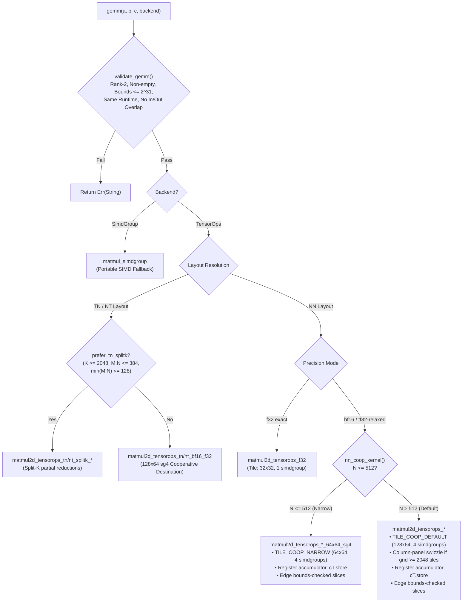

# Architecture

How `tessl` selects GEMM kernels, how cooperative destination registers eliminate memory traffic, and the evolution of its tiling and swizzle strategies.

---

## GEMM Pipeline & Kernel Selection

Every GEMM invocation validates tensors, resolves layout orientations (NN, TN, NT), and routes execution to the optimal Metal Performance Primitives (MPP) TensorOps kernel.



---

## Two Accumulation Models

### 1. Blocked Accumulation (Legacy / Fallback)
Loops over $K$ in $BK = 256$ chunks, accumulating into a **device-memory** $C$ tile. Block 0 uses `mode::multiply` (seeding $C$ to avoid host-side pre-zero passes); subsequent blocks use `mode::multiply_accumulate`.

In the blocked kernel, memory bandwidth to $C$ scales with $K / BK$ while useful compute scales with $K$. At $M=N=4096, K=8192$, that represents 32 read-modify-write passes over a 67 MB tile for an operation that only needs to store its result once.

### 2. Cooperative Destination Accumulation (Production)
Holds the $C$ accumulator in hardware SIMDgroup registers via `get_destination_cooperative_tensor` across the entire $K$-reduction and writes to device memory **exactly once** (`cT.store(tC)`).

```metal
auto cT = op.template get_destination_cooperative_tensor<
    metal::remove_addrspace_t<decltype(tA)>,
    metal::remove_addrspace_t<decltype(tB)>, float>();

#pragma clang loop unroll(full)
for (uint16_t i = 0; i < cT.get_capacity(); ++i)
    cT.set(i, 0.0f);

op.run(tA, tB, cT);
cT.store(tC);
```

- **Zero Host Pre-Zeroing:** Accumulators are initialized to `0.0f` in hardware registers.
- **Constant C-Traffic:** Memory writes to $C$ are $O(1)$ with respect to $K$.
- **Edge-Slice Support:** Ragged boundary tiles execute origin-shifted full-extent tensor slices (`mA.slice(...)`, `mB.slice(...)`, `mC.slice(...)`), preserving register accumulation across all shapes.

---

## Round 2 Evolutions

In Round 2 optimization, cooperative destination registers were extended across all primary layouts:

| Layout / Path | Geometry | Implementation | Performance Impact |
|---|---|---|---|
| **NN Default** | $128 \times 64$, 4 sg | `matmul2d_tensorops_bf16_f32` + swizzle | **26,642 GFLOP/s** at $4096^3$ (+11% via swizzle) |
| **NN Narrow ($N \le 512$)** | $64 \times 64$, 4 sg | `matmul2d_tensorops_bf16_f32_64x64_sg4` | +6% on narrow-$N$ shapes |
| **TN bf16 Descriptor** | $128 \times 64$, 4 sg | `matmul2d_tensorops_tn_bf16_f32` | 1.52–1.98× over dynamic-$K$ multiply |
| **NT bf16 ($dX$ Backward)** | $128 \times 64$, 4 sg | `matmul2d_tensorops_nt_bf16_f32` | 2.00–2.03× speedup at scale |
| **Accumulate Paths** | $64 \times 64$, 4 sg | Zero $\to$ Run $\to$ Load-Add-Store (`TILE_COOP_ACCUM`) | 1.38–1.49× over `multiply_accumulate` |
| **Split-K $dW$** | $64 \times 32$, 4 sg | `matmul2d_tensorops_tn_splitk_*` | Preserved for tall-$K$ / small-$MN$ |

### Column-Panel Grid Swizzling

For large grids ($\text{tiles}_n \times \text{tiles}_m \ge 2048$), threadgroups are swizzled into 8-tile-row bands:

```metal
if (tiles_n * tiles_m >= 2048u) {
    constexpr uint PH = 8;
    uint band = tgpig / (PH * tiles_n);
    uint rem = tgpig - band * PH * tiles_n;
    uint local_h = min(PH, tiles_m - band * PH);
    tile = uint2(rem / local_h, band * PH + rem % local_h);
} else {
    tile = tile_from_linear(tgpig, tiles_n, tiles_m);
}
```

This bounds operand $B$ rereads to $\text{tiles}_m / 8$ passes, boosting large square throughput ($4096^3$) from 24.9 TFLOP/s to 29.0 TFLOP/s on Apple M5 Pro.

---

## The Kernel Library and the `nn` Boundary

The 18 Metal sources compile to 72 kernel entry points. They arrived here by
promotion out of `gemma-metal`, where they were reachable only as raw pipeline
name strings through an overlay metallib — meaning a typo in a name was a
runtime failure, and nothing checked that a buffer was large enough for the grid
being dispatched over it.

`src/nn.rs` is the boundary that ended that. 62 public functions, each of which
resolves the pipeline by a name fixed at the call site and validates every
operand before encoding anything.

```mermaid
flowchart LR
    accTitle: Validation Before Encoding
    accDescr: A caller enters a typed nn function, which computes the element count, checks each buffer's capacity and the dimension arguments, and only then binds and dispatches. Any failed check returns an error before any GPU work is encoded.

    call([Typed nn call])
    elems["elems(rows, dim)<br/>checked multiply"]
    req["require::&lt;T&gt;(buf, n)<br/>capacity vs elements"]
    dims{"dims non-zero,<br/>scalars finite?"}
    err["❌ Err(String)<br/>dispatch count still 0"]
    bind["Binder: argument table"]
    disp([⚡ dispatch])

    call --> elems --> req --> dims
    dims -- no --> err
    dims -- yes --> bind --> disp

    classDef danger fill:#fee2e2,stroke:#dc2626,stroke-width:2px,color:#7f1d1d
    classDef primary fill:#dbeafe,stroke:#2563eb,stroke-width:2px,color:#1e3a5f
    class err danger
    class call,disp primary
```

The ordering is the design. `elems` is a checked multiply, so a `rows × dim`
that would wrap `usize` is refused rather than producing a small product that
then passes a capacity check against a small buffer. `require::<T>` compares
element counts, not bytes, so an `f32` view of an `f16` buffer cannot satisfy
it by accident.

`tests/nn_adversarial.rs` asserts the whole surface refuses without encoding.
The checks are load-bearing rather than defensive decoration: with `require`
disabled the adversarial suite does not fail cleanly, it hangs the GPU past a
two-minute timeout.

The `_with_scalars` seam is what keeps this from being 62 near-duplicate
signatures. Each entry point takes a closure that binds the kernel's scalar
arguments, so the shared validation is written once and the kernel-specific
parameter block stays at the call site.

---

## Fused Epilogue

`gemm_epilogue` computes `C = activation(alpha * A@B + beta * C_prev + bias)`
inside the cooperative-destination kernel, while the accumulator is still in
registers.

The saving is memory traffic, not arithmetic. Bias and activation as separate
kernels each read all of `C` and write all of `C`; on a bandwidth-bound machine
that is most of what the GEMM just saved. Fused, `C` is written exactly once
and read at most once — only when `beta != 0`.

Bias is per-column and reaches the kernel through a **row-stride-0 tensor
view**, so the same cooperative `load` that fetches `C_prev` fetches the bias
with no separate indexing path.

Measured on an M5 Pro against `gemm` plus a single `add_inplace_f32` sweep —
which is strictly less work than a real bias broadcast, and half the work of
bias plus a separate activation:

| shape | `gemm` | fused | `gemm` + one pass | epilogue cost |
| --- | ---: | ---: | ---: | ---: |
| 512³ | 0.332 ms | 0.491 ms | 0.640 ms | 0.159 ms |
| 1024³ | 0.369 ms | 0.399 ms | 0.559 ms | 0.030 ms |
| 2048×2048×512 | 0.453 ms | 0.615 ms | 0.912 ms | 0.162 ms |

Fusing beats that lower bound at every shape. The absolute numbers move with
machine load — an earlier run under load average 52 showed the same ordering
with every arm slower — so the comparison is run interleaved in one process
rather than across sessions.

It requires the cooperative path: bf16 operands, or f32 with relaxed precision.
The exact-f32 and simdgroup kernels write `C` straight from the matmul with no
register accumulator, so there is nothing to fuse into. Those are **refused**
rather than silently falling back to separate dispatches, which would make the
call quietly slower than the unfused code it replaced.

`Activation::GeluTanh` uses the same clamped `precise::tanh` formulation as
`nn::mlp_gelu_tanh`, deliberately copied rather than re-derived: at `-O2` MSL
lowers a plain `tanh` to `air.fast_tanh`, which returns NaN past roughly |10|.
A crate with two different GELUs would be a worse defect than a slow one.

---

## Reductions and Numerical Safety

`softmax_rows_f32`, `row_sum_f32` and `row_max_f32` share a `REDUCE_TREE` macro
with a 1024-thread threadgroup ceiling.

Softmax's whole reason for existing in a stable form is the overflow it avoids,
so it subtracts the row max before exponentiating. `exp(89)` is already infinity
in f32; a naive implementation returns NaN for every row of attention logits
above that. A **fully masked row** — every position `-inf`, which is what an
attention row looks like when nothing is visible — would divide by a zero
denominator, so it returns uniform rather than NaN, and `tests/reductions.rs`
pins that case specifically.

The tree reduction reassociates against a sequential sum. That is a deliberate
trade, and it is bounded rather than ignored: row sums are checked against an
f64 reference within `8·eps·n·max|term|`, while `row_max` is checked for exact
equality, because a maximum does not reassociate.

---

## Integer GEMM

`nn::gemm_i8_dequant` multiplies `int8 × int8` into `int32` and applies
per-column dequantization in the same dispatch.

The accumulation is **exact**, so its tests assert integer equality rather than
a tolerance, with operands pinned at the extremes of the range (−128 and 127).
That exactness has a bound: a full-range dot product can wrap `int32` past
`k = 131_072`, so larger `k` is refused rather than silently returning a wrapped
sum.

TensorOps itself accepts `int4b_format` — the reason there is no Int4 GEMM here
is the shader-side tensor constructor for a sub-byte element type, not the host
binding. An earlier version of this document and the README both blamed
`MTLTensorDataType::Int4` being unbound in objc2-metal 0.3. That is true and
irrelevant: it gates host-created `MTLTensor` descriptors, and every kernel here
builds tensors from raw device pointers.

---

## Static Tile Ownership Audit

The Rust `TileGeom` constants (`TILE_COOP_DEFAULT`, `TILE_COOP_NARROW`, `TILE_COOP_TN_NT`, `TILE_COOP_ACCUM`, `TILE_F32`, `TILE_V2`) must strictly equal the `SM`/`SN` compiled into shader kernels.

Because Rust's type system cannot verify shader constants at compile time, [`scripts/audit_gemm_tiles.py`](../scripts/audit_gemm_tiles.py) verifies:
1. Every Rust `TileGeom` matches the `constexpr int SM/SN` or macro arguments in Metal shaders.
2. Every cooperative kernel is pinned in `NN_PAIRS` so no variable-dispatched pipeline escapes examination.
3. 100% of all 15 compiled GEMM pipelines pass verification with 0 mismatches.
