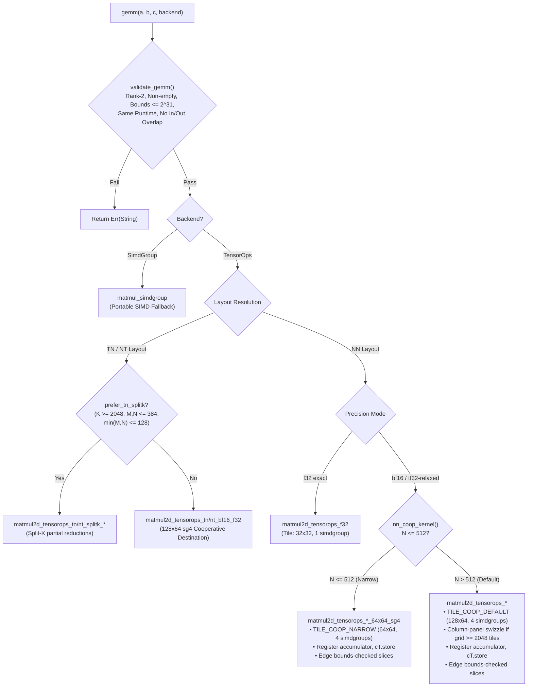

# Architecture

How `tessl` selects GEMM kernels, how cooperative destination registers eliminate memory traffic, and the evolution of its tiling and swizzle strategies.

---

## GEMM Pipeline & Kernel Selection

Every GEMM invocation validates tensors, resolves layout orientations (NN, TN, NT), and routes execution to the optimal Metal Performance Primitives (MPP) TensorOps kernel.



---

## Two Accumulation Models

### 1. Blocked Accumulation (Legacy / Fallback)
Loops over $K$ in $BK = 256$ chunks, accumulating into a **device-memory** $C$ tile. Block 0 uses `mode::multiply` (seeding $C$ to avoid host-side pre-zero passes); subsequent blocks use `mode::multiply_accumulate`.

In the blocked kernel, memory bandwidth to $C$ scales with $K / BK$ while useful compute scales with $K$. At $M=N=4096, K=8192$, that represents 32 read-modify-write passes over a 67 MB tile for an operation that only needs to store its result once.

### 2. Cooperative Destination Accumulation (Production)
Holds the $C$ accumulator in hardware SIMDgroup registers via `get_destination_cooperative_tensor` across the entire $K$-reduction and writes to device memory **exactly once** (`cT.store(tC)`).

```metal
auto cT = op.template get_destination_cooperative_tensor<
    metal::remove_addrspace_t<decltype(tA)>,
    metal::remove_addrspace_t<decltype(tB)>, float>();

#pragma clang loop unroll(full)
for (uint16_t i = 0; i < cT.get_capacity(); ++i)
    cT.set(i, 0.0f);

op.run(tA, tB, cT);
cT.store(tC);
```

- **Zero Host Pre-Zeroing:** Accumulators are initialized to `0.0f` in hardware registers.
- **Constant C-Traffic:** Memory writes to $C$ are $O(1)$ with respect to $K$.
- **Edge-Slice Support:** Ragged boundary tiles execute origin-shifted full-extent tensor slices (`mA.slice(...)`, `mB.slice(...)`, `mC.slice(...)`), preserving register accumulation across all shapes.

---

## Round 2 Evolutions

In Round 2 optimization, cooperative destination registers were extended across all primary layouts:

| Layout / Path | Geometry | Implementation | Performance Impact |
|---|---|---|---|
| **NN Default** | $128 \times 64$, 4 sg | `matmul2d_tensorops_bf16_f32` + swizzle | **29,022 GFLOP/s** at $4096^3$ (+11% via swizzle) |
| **NN Narrow ($N \le 512$)** | $64 \times 64$, 4 sg | `matmul2d_tensorops_bf16_f32_64x64_sg4` | +6% on narrow-$N$ shapes |
| **TN bf16 Descriptor** | $128 \times 64$, 4 sg | `matmul2d_tensorops_tn_bf16_f32` | 1.52–1.98× over dynamic-$K$ multiply |
| **NT bf16 ($dX$ Backward)** | $128 \times 64$, 4 sg | `matmul2d_tensorops_nt_bf16_f32` | 2.00–2.03× speedup at scale |
| **Accumulate Paths** | $64 \times 64$, 4 sg | Zero $\to$ Run $\to$ Load-Add-Store (`TILE_COOP_ACCUM`) | 1.38–1.49× over `multiply_accumulate` |
| **Split-K $dW$** | $64 \times 32$, 4 sg | `matmul2d_tensorops_tn_splitk_*` | Preserved for tall-$K$ / small-$MN$ |

### Column-Panel Grid Swizzling

For large grids ($\text{tiles}_n \times \text{tiles}_m \ge 2048$), threadgroups are swizzled into 8-tile-row bands:

```metal
if (tiles_n * tiles_m >= 2048u) {
    constexpr uint PH = 8;
    uint band = tgpig / (PH * tiles_n);
    uint rem = tgpig - band * PH * tiles_n;
    uint local_h = min(PH, tiles_m - band * PH);
    tile = uint2(rem / local_h, band * PH + rem % local_h);
} else {
    tile = tile_from_linear(tgpig, tiles_n, tiles_m);
}
```

This bounds operand $B$ rereads to $\text{tiles}_m / 8$ passes, boosting large square throughput ($4096^3$) from 24.9 TFLOP/s to 29.0 TFLOP/s on Apple M5 Pro.

---

## Static Tile Ownership Audit

The Rust `TileGeom` constants (`TILE_COOP_DEFAULT`, `TILE_COOP_NARROW`, `TILE_COOP_TN_NT`, `TILE_COOP_ACCUM`, `TILE_F32`, `TILE_V2`) must strictly equal the `SM`/`SN` compiled into shader kernels.

Because Rust's type system cannot verify shader constants at compile time, [`scripts/audit_gemm_tiles.py`](../scripts/audit_gemm_tiles.py) verifies:
1. Every Rust `TileGeom` matches the `constexpr int SM/SN` or macro arguments in Metal shaders.
2. Every cooperative kernel is pinned in `NN_PAIRS` so no variable-dispatched pipeline escapes examination.
3. 100% of all 15 compiled GEMM pipelines pass verification with 0 mismatches.
