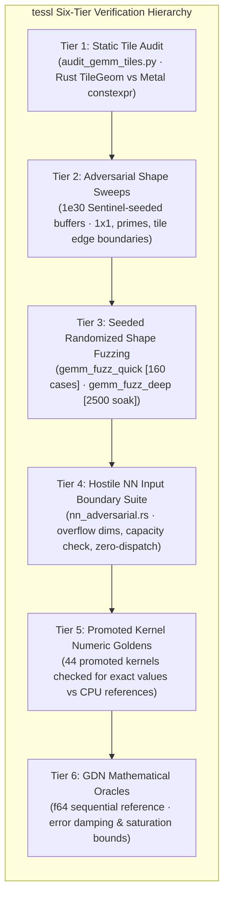
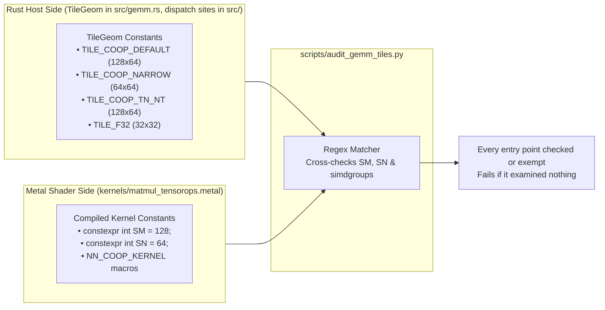
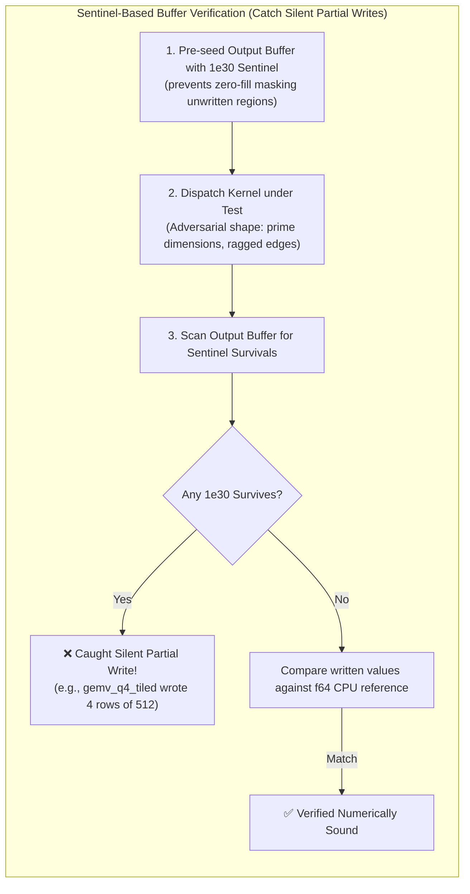
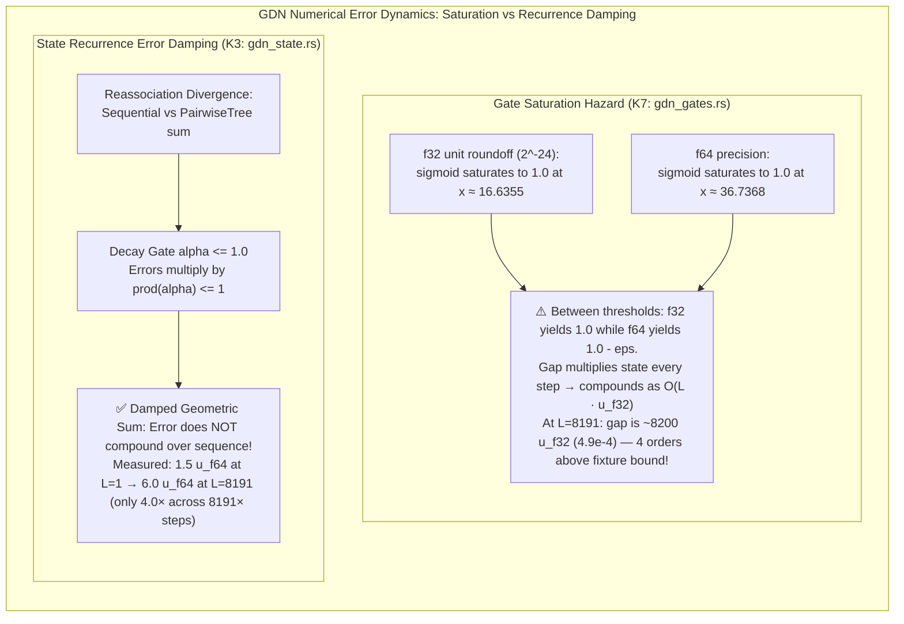

# Verification

Three layers (§1-3), each of which was shown to **fail** on an injected fault. A
check that has never failed is not known to work — and a check that *can no
longer* fail has stopped working while still printing a pass, which is what §1
records about the static audit's retired `BKC` half.



## 1. Static audit

```bash
python3 scripts/audit_gemm_tiles.py
```



Cross-checks, mechanically, the relationship Rust's type system cannot express:
every Rust `TileGeom` against the `SM`/`SN` and simdgroup count compiled into the
kernel it dispatches. A mismatch means the host launches the wrong threadgroup
count and leaves output tiles unwritten. The kernel side is read from
`constexpr int SM`/`SN`, from the arguments of each `*_KERNEL(...)` macro
instantiation, or from a helper's template defaults when a kernel calls it with
no template argument list — `matmul2d_tensorops_bf16_f32`, the production NN
kernel, is that last case and takes its 128×64/sg4 from `mm_nn_coop_f32acc`.

It fails closed rather than skipping:

- every entry point in `matmul_tensorops.metal` must be checked or named in the
  script's `EXEMPT` with a reason. None is exempt: `matmul2d_tensorops_i8_f32`
  was, while `src/nn.rs` dispatched it with local `SM`/`SN` constants; it now
  takes `TILE_COOP_DEFAULT`, and a kernel both checked and exempt fails;
- literal `pipeline("matmul2d_tensorops_...")` calls are read from every file
  under `src/`, not only `gemm.rs`, and one with no `TILE_*` within 12 lines
  fails, even when its kernel is checked through another site;
- a `*_KERNEL(` invocation it cannot parse, a pin naming a kernel that no longer
  exists, and a pinned kernel whose geometry it cannot see each fail the audit;
- an audit that parsed no kernels, or checked no Rust dispatch pairs, fails.

Its `PASS` line names what it checked. On 2026-10-07:

```
PASS: tile geometry: 27 kernels, 31 Rust dispatch pairs; 0 exempt (none)
```

Paths resolve from the script's own location, so it runs from any directory and
from inside an extracted `.crate`. `tests/audit_gemm_tiles.rs` runs a copy of the
script against injected faults under `cargo test`: a tile drift, a drifted
template default, an unaccounted kernel, an unparseable kernel macro, an empty
kernel file, an empty `gemm.rs`, a wrong tile at the `src/nn.rs` i8 dispatch,
and that dispatch with no `TileGeom` at all. The script as it stood at
`dade8e2` printed `PASS` on the wrong i8 tile. Against the script as it stood at `52c091c`,
the tile drift failed, the empty `gemm.rs` crashed with a `KeyError`, and the
other four printed `PASS`.

### The retired `BKC` check (`GAP-TESSL-AUDIT-BKC-CHECK-DEAD`, closed)

The script used to claim a second relationship — each cooperative kernel's
`constexpr int BKC` against a Rust `COOP_BKC` — and printed `COOP_BKC = None`
followed by `PASS: 0 mismatch(es)` having examined none of it. Its fallback
guards keyed on a `_coop` entry-point suffix, so they could not fire either.

git history settles why, and the answer is neither a deliberate retirement nor
a rename: the check never applied to tessl. Across every commit, `COOP_BKC`
appears in no file under `src/`, `constexpr int BKC` in no file under
`kernels/`, and no entry point carries a `_coop` suffix (`git log -S` and
`git grep` over all 169 revisions, 2026-10-06). `COOP_BKC` appears only in docs from `84a52a1`, which predates tessl's
kernel sources, and in this script from `d4e4f2d`, where it arrived already
dead. Both describe the blocked kernels of the code tessl was extracted from,
whose `for k; k + BKC <= K` loop could drop a K tail. Every tessl kernel passes
K to `matmul2d_descriptor` as `dynamic_length_v<int>` and reduces all of it
inside `op.run()`, so there is no host-side K block for a gate to disagree with.

So the `BKC` half was deleted, not repaired. The `_coop`-suffix unpinned-kernel
guard was replaced by the every-entry-point rule above. Under the old script, 17
of the 27 entry points were checked; the other ten passed unexamined:
`matmul2d_tensorops_bf16_f32` (skipped as "no compile-time SM/SN"), the two
f16 NN kernels and three `*_batched` kernels (selected through a variable, never
pinned), the three split-K kernels (tile argument past the 8-line pairing
window, now 12), and `matmul2d_tensorops_i8_f32` (exempt, then checked; above).

tessl carries no gap ledger of its own; `GAP-TESSL-*` records live in the
consuming project's, at `~/Code/research/Lappi-decision/gaps.jsonl`, which is
also where `GAP-TESSL-NPY-READER-REFUSES-F64-REFERENCE` (cited from
`gdn_fixtures.rs`) is recorded. A record's current state is its last line under
that id.

## 2. Adversarial shape sweep

Hand-picked shapes across every dispatch path: degenerate (1×1×1), primes,
one-off tile boundaries (63/65/127/129/257), exact tile multiples, extreme
aspect ratios, and shapes straddling each clause of the cooperative gate.



Output buffers are pre-seeded with a `1e30` sentinel, so a tile the kernel fails
to write is **caught** rather than read as a plausible number. Results are
checked against an f64 CPU reference; accumulating paths are checked for
`C0 + A@B` rather than `A@B`.

## 3. Randomized shape fuzz

```bash
# 160 cases, part of the ordinary suite
cargo test --release --lib -- --test-threads=1 --nocapture gemm_fuzz_quick

# 2500-case soak, #[ignore]d so it stays out of the default run
cargo test --release --lib -- --ignored --test-threads=1 --nocapture gemm_fuzz_deep

# replay a failing seed
STRESS_SEED=0xdeadbeef cargo test --release --lib -- --test-threads=1 gemm_fuzz_quick
```

Deterministic and seeded, so a failure prints the seed and shape and reproduces
exactly.

> [!CAUTION]
> Everything this section said before 2026-08-31 was wrong, and wrong in the
> way this document exists to prevent. It documented a test named
> `gemm_randomized_shape_fuzz` and two environment variables `GEMM_FUZZ_SEED`
> and `GEMM_FUZZ_CASES`. None of the three exist. The command it told you to run
> therefore matched no test and printed:
>
> ```
> running 0 tests
> test result: ok. 0 passed; 0 failed; 89 filtered out
> ```
>
> A verification command that runs nothing and reports `ok` is worse than no
> command, because it converts an unexamined kernel into a documented green
> tick. It also claimed the fuzzer "asserts its own coverage — every kernel
> `gemm` can select must be chosen for at least 1% of cases or the run fails".
> No such assertion is implemented. Per-kernel coverage accounting would be
> worth having; until it exists, the fuzzer checks correctness on the shapes it
> happens to draw and nothing more.

**Malformed env values panic rather than falling back.** A seed parsed with
`.ok()` and silently discarded means a soak across eight seeds re-runs one seed
eight times and reports success every time. `STRESS_SEED` accepts hex or
decimal and refuses anything else loudly.

## 4. Hostile input across the `nn` surface

```bash
cargo test --release --test nn_adversarial -- --test-threads=1
```

Every entry point in `tessl::nn` is driven with undersized buffers, degenerate
dimensions, non-finite scalars, and dimension products chosen to overflow. Each
case asserts three things, and the third is the one that matters: the call
returns `Err`, it does not panic, and `take_dispatch_count()` is still zero.
Without that third assertion a kernel that validated *after* encoding would pass
while still having submitted work.

The checks are load-bearing rather than decorative. Compiling `nn` with the
`require` capacity checks disabled does not produce a clean failure — the suite
hangs the GPU past a 120-second timeout, against 0.06 s with them in place.

## 5. Numeric coverage of the promoted kernels

`promoted_kernels.rs` asserts each of the 44 promoted entry points resolves out
of tessl's own metallib. That is a gate on the *move*, not on correctness: a
kernel can resolve, dispatch, and return wrong numbers.

It did. `gemv_q4_tiled` resolved, had adversarial coverage of its error paths,
and wrote 4 rows of 512 because the host handed it the other Q4 kernel's grid.
Giving every promoted kernel a numeric test found six defects in total — two
grid mismatches, one undocumented weight layout, uninitialised threadgroup
scratch across half of every attention query block, a NaN in the online softmax,
and an output-width validation that made `out_bf16` unusable.

All 44 now have one, in `nn_kernels.rs`, `reductions.rs`, `nn_wiring.rs`,
`promoted_numeric.rs`, `attention.rs`, `qkv_rope.rs` and `q4_interleaved.rs`.
Where a family is selected by an enum or a bool, every arm is exercised: the
three Q4 MLX row variants share one reference, and both `Q4MlxLayout` packings
are checked against each other as well as against the dense reference.

## 6. CPU oracles for the GDN kernels (K1-K7)

No Metal kernel work is authorized yet — K1-K7 start after the shipping gate — so
this layer is the part that can be built first: the references the kernels will be
judged against, pinned before any kernel exists to shade them.

Two files, neither of which touches the GPU, so both run on any host:

- **`gdn_fixtures.rs`** — the published fixture corpus (13 cases) and its load
  path. Each case ships `y_chunked` (f32) and `y_seq_f64` (f64); only the second
  is an independent golden, because the first is the output of the algorithm
  under test. Agreement is held to `64 * u_f32`, derived from a worst observed
  1.473e-6 (24.7 u) on `L127c64`.
- **`gdn_gates.rs`** — **K7**, gate production. The fixtures store *post*-gate
  `alpha`/`beta`, so the corpus cannot test K7 at all: it is the one kernel in
  the set with no golden. This file is that golden.
- **`gdn_state.rs`** — **K3**, the state update, and the bound it must be judged
  by rather than the one the corpus currently uses.

`tests/common/gdn.rs` holds both references. It carries two deliberately wrong
operators alongside the right ones, so a test can *measure* each divergence
rather than assert its absence:

| the wrong thing | why it is in the file |
| --- | --- |
| `Rule::Repo` — the delta correction reads the undecayed state | nanolab's *default*. Diverges up to 31% of output magnitude, and **coincides exactly at `t = 0`** |
| `alpha_mamba2_refuted` — the build plan's K7 | the Mamba2/SSD decay from a different mixer in the same source file |



### What K7's reference owns

Three things a kernel author would otherwise have to get right unaided, each of
which fails silently:

- **A layout change.** `a_gate`/`b_gate` are the tail of a split over the feature
  axis, so they arrive `[B, T, H]` — head index last. The recurrence wants
  `[B, H, L]`. Same element count, and every value still a sigmoid, so a missed
  transpose passes any shape, dtype or range check. `gates_published` consumes
  `[B,T,H]` and returns `[B,H,L]`, so a caller cannot skip it.
- **A per-head bias.** `decay_bias`/`update_bias` are `[H]`, broadcast over batch
  and position. An `[L]`-indexed bias is the same dtype and often the same
  length; it is refused by name.
- **The clamps, three of which cannot do anything.** `sigmoid` has range `(0, 1)`
  exactly and `[0, 1]` after rounding, so `alpha`'s ceiling and both of `beta`'s
  bounds can be attained but never exceeded — clamping there is arithmetically a
  no-op. The only clamp that changes a value is `alpha`'s floor of 1e-4, below
  `ln(1e-4/(1-1e-4)) = -9.21024`. That is why `L65_tinyalpha` is a fixture, and
  why clamping is applied in the reference rather than left to a caller: without
  it that case reproduces its golden to only 8.4e-5, with it to 1.9e-16.

### Two findings the plan did not carry

**The plan's K7 is a sign flip in disguise.** With the zero-initialised
parameters nanolab ships, `exp(-exp(0) * softplus(x))` is `exp(-ln(1 + e^x))`,
which is `1/(1 + e^x)`, which is **`sigmoid(-x)`** — an algebraic identity, not an
approximation. So the plan's formula and the real one agree *to the last bit* at
`a_gate = 0`, where an untrained checkpoint sits, and separate into mirror images
only once training moves the gate off zero. A kernel written from the plan and
smoke-tested on fresh weights would look correct, and would then rank every pair
of positions in reverse. This is the third defect in this project with that
shape: the two delta rules coincide at `t = 0`, and the conformal nonconformity
and probability scales coincide at `q_hat = 0.5`.

**Saturation is arithmetic-dependent, and it compounds past the fixture bound.**
f64 `sigmoid` returns exactly 1.0 above x ~= 36.7368; an f32 kernel does so above
x ~= 16.6355, because its unit roundoff is `2^-24`. Between those thresholds the
kernel yields `alpha == 1.0` while the reference yields `1.0 - eps` — at most one
`u_f32` per step, but `alpha` multiplies the state once per step, so across `L`
steps the gap on the decay product grows to about `L * u_f32`. At `L = 8191`,
tessl's longest fixture, that is 4.9e-4: **8200 `u_f32`, four orders above the
`64 * u_f32` bound `gdn_fixtures.rs` holds the chunked kernel to.** An
early-saturating K7 kernel is therefore not automatically wrong, and equally
cannot be judged by the fixture bound. Both thresholds are found by bisection in
`alpha_saturates_to_exactly_one_later_in_f64_than_in_f32`, not asserted from a
table.

A related limit on what a fixture can ever prove about K7: the corpus stores
post-gate `alpha`/`beta` as **f32**, so the fixture's own gate is already rounded.
K7 cannot be held to better than f32 against a fixture, whatever the kernel does.

### What K3 is, and what its reference owns

**First, a limit on this whole section.** The plan document that enumerates
K1–K7 is not in either repository. `K7` is named once —
`gdn_gate_prologue`, at `docs/plan-corrections.md:244` — and K3 is named
nowhere. Its identity here is reconstructed from seven cross-references, which
agree but do not amount to a specification:

| what the references pin | where |
| --- | --- |
| a GDN **state update**, reassociated across lanes, so it needs an f64 reference | `tessl-integration.md:572` |
| judged as a **K-term accumulation** — *"a delta-rule state update is"* one | `:639` |
| chained after K7 on one encoder, which gets ordering for free | `:275` |
| writes state, so it must call `require_disjoint_writes` | `:706` |
| asserts lane width against the pipeline rather than assuming it | `:525` |
| may want compile-time head-dim / tile variants, as K1/K2 do | `:1201`, `:1207` |

That is enough to build the **oracle**, because the recurrence is the same
operator whichever chunking variant K3 turns out to be. It is **not** enough to
write the Metal kernel: no entry-point name, signature, or tiling is recorded
anywhere. **Open: `GAP-TESSL-K3-IDENTITY-NOT-SPECIFIED`.**

`state_update_f64` therefore returns a `StateUpdate` rather than a bare `y`:

- `y` — `[B,H,L,D]`, bit-identical to what `sequential_f64` returned before
  (`sequential_f64` is now a one-line delegate, so there is one recurrence in the
  file and not two).
- `y_mag` — `sum_p |S[p][n] * q[p]|`, the quantity §C.3's bound is proportional
  to.
- `pred_mag` — `sum_p |S[p][n] * k[p]|`, the *other* `d`-term accumulation. It
  feeds `delta` and so the state, reaching it one step before `y`.

and `SumOrder` selects how the two dot products are summed: `Sequential`, or
`PairwiseTree` — recursive halving, the shape a simdgroup shuffle-down reduction
produces. Both orders in f64 means a divergence between them is *purely*
reassociation, with precision held constant. That is what makes the next finding
an answer rather than an estimate.

### Four findings from K3's measurements

**1. Reassociation does not compound over the sequence.** Worst divergence
between the two summation orders, relative to each element's own magnitude:
**1.5 `u_f64` at L=1, 6.0 `u_f64` at L=8191 — a factor of 4.0 across 8191× the
steps.** If it accumulated, the factor would be nearer 8191×. The mechanism is
the gate: an error entering the state at step *t* reaches `y` at step *t'*
multiplied by the product of `alpha` between them, which is at most 1, so the
contributions form a damped sum rather than a growing one. **A K3 bound therefore
does not need to scale with sequence length** — which is the opposite of the
saturation hazard in `gdn_gates.rs`, where the gap grows like `L * u_f32` because
`alpha` multiplies the state every step with nothing to damp it. Two GDN error
sources, opposite behaviour, same operator.

**2. The corpus gate is far too loose, not too tight.** `gdn_fixtures.rs` judges
the chunked output by `64 * u_f32 * max|y|`, a *global* scale. Against the derived
per-element `gamma_d(u_f32) * y_mag`:

- at every case's **widest** element the global bound is still the looser of the
  two, so the existing gate never rejects lawful f32 arithmetic — nothing here
  asks for it to be moved, and it is not moved (gates are read-only);
- at every case's **quietest** element it is looser by **528× to 75,184×**.

So a K3 defect confined to low-magnitude elements could be four orders of
magnitude worse than f32 arithmetic permits and still pass. The mechanism is
exact, not a correlation: `slack = (64/d) * (dynamic range of y_mag)`, verified to
within 1e-6 on all 13 cases — **8.0000× the range** at `d = 8`. An earlier draft
of this note blamed cancellation instead; the corpus refutes that directly, since
L65 cancels hardest (1.9e5 : 1) and has nearly the *least* slack, while
L65_tinyalpha cancels 58× less and has the most.

**3. Cancellation rules out the obvious bound.** Worst `y_mag / |y|` over the
corpus is **186,971× on L65**. A per-element `|y|`-proportional bound would there
demand about 17 significant bits beyond f32's 24, so a suite built on one would
fail on correct code. This is exactly the failure §C.3 warns about, with a
measured number attached.

**4. The corpus is `d = 8`; the model is `d = 128`.** Qwen3.5-2B's GDN state is
16×128×128. `gamma_128 / gamma_8 = 16.00`, so any bound calibrated on this corpus
understates the model's per-step accumulation budget by 16× **before** recurrence
depth is considered. A K3 kernel that passes at `d = 8` is not thereby known to
pass at `d = 128`.

### Mutation coverage

Same method as the fault-injection table below, run against both GDN references:
**19 defects injected into `tests/common/gdn.rs`, 19 caught.**

| injected fault | caught by |
| --- | --- |
| `[B,T,H]` read as `[B,H,L]` (no transpose) | 4 tests |
| bias indexed by position instead of head | `bias_is_per_head_and_broadcasts_over_batch_and_position` |
| `a_gate` wired into `alpha` twice | `a_gate_drives_alpha_and_b_gate_drives_beta` |
| `alpha`'s floor dropped | 3 tests |
| caller's clamp ignored, bounds hardcoded (`alpha`, then `beta`) | `the_clamp_is_a_parameter_not_a_constant` |
| NaN gate logit passed through instead of refused | `a_nan_gate_logit_is_refused_not_clamped` |
| non-finite bias passed through | `a_non_finite_bias_is_refused` |
| refuted reference implemented as a sigmoid (cannot show divergence) | 5 tests |
| `exp(A_log)` dropped from the refuted decay rate | 2 tests |
| sign error in `sigmoid`'s negative branch | 7 tests |
| `softplus` without the `max(x,0)` shift | `the_refuted_reference_holds_up_at_a_large_logit` |
| mis-shaped gate accepted rather than refused | `a_misshaped_gate_is_refused_rather_than_reinterpreted` |
| wrong-length bias accepted | `a_bias_indexed_by_position_is_refused` |
| `sum_tree` drops the odd tail | `a_single_step_matches_its_closed_form_at_odd_and_even_d` |
| `sum_tree` folds the same element each round | 2 tests |
| `PairwiseTree` silently reuses the sequential sum | `reassociation_error_does_not_compound_over_the_sequence` |
| state indexed `s[n*d + p]` instead of `s[p*d + n]` | 2 tests |
| magnitudes sum signed products, so they cancel | 6 tests |
| `pred_mag` deleted, or taken after the update | `the_second_step_pins_pred_mag_against_its_closed_form` |
| `pred_mag` returned in `y_mag`'s slot | 4 tests |
| `sequential_f64` delegates with the wrong order | `the_rust_f64_reference_reproduces_the_published_golden` |
| state not reset between `(b, h)` pairs | 2 tests |

**Four of those tests exist only because the mutation run demanded them.** For
K7, nothing exercised the refuted reference at a magnitude where the naive
`ln(1 + exp(x))` overflows, and nothing passed it a non-finite parameter. The
overflow is not merely imprecise — `exp(-1e-3 * inf)` is 0, so a gate that should
decay to 0.449 reads as *total* decay, making the divergence the file exists to
measure look larger than it is.

For K3 the two gaps were sharper. **Every fixture is `d = 8`, and 8 halves to 4,
2, 1 without ever leaving an odd count** — so the corpus cannot reach `sum_tree`'s
odd tail at all, and the claim that the tail is carried rather than dropped was
untested. `a_single_step_matches_its_closed_form_at_odd_and_even_d` reaches it at
`d = 5` and `d = 7`, against a closed form (`y[n] = beta * v[n] * <k, q>`, which
the recurrence collapses to at `t = 0`) rather than against another
implementation. And **`pred_mag` was verified by nothing**: the only test touching
it asserted it is zero at `t = 0`, which a `pred_mag` that is zero *everywhere*
also satisfies. Deleting the computation outright passed the whole suite. It is
now pinned at `t = 1`, where there is again a closed form, with operands whose
signs alternate so that `sum |k0 k1|` pulls clear of `|sum k0 k1|` — otherwise the
check would only be re-testing `pred`.

Two injected faults were caught by nothing and were bad injections rather than
gaps. Hardcoding the published clamp bounds in `sequential_f64` is a no-op for a
suite that only ever passes `GateClamp::PUBLISHED` to it. And removing the `.abs()`
from `abs_dot_state`'s *operand* changes nothing, because the *product* is absed
and `|a*b| == |a|*|b|` — that one found redundant code rather than a missing test,
and the redundancy was deleted. Both are recorded because "the test didn't catch
it" and "there was nothing to catch" look identical in a log.

## Fault injection

The suite is only worth its green tick if it can go red. Six faults injected
into the cooperative kernels, six caught:

| injected fault | caught by |
| --- | --- |
| `BKC` 128 → 256 (K tail silently dropped) | fuzz + sweep |
| tile `SM` 64 → 128 (rows unwritten) | fuzz + sweep |
| accumulator store removed | sentinel check |
| accumulator seeded non-zero | reference check |
| every other K block skipped | reference check |
| column offset off by one | sentinel check |

This table predates tessl's own kernel sources: it is already present, unchanged,
in `84a52a1`, which commits no file under `kernels/`. Its `BKC` and K-block rows
describe the blocked-K kernels of the code tessl was extracted from; tessl's
kernels have no K block to mutate (§1, the retired `BKC` check). The table has
not been re-run against tessl's kernels.

Two earlier "faults" were caught by nothing — and both were bad injections, not
gaps: one was a no-op (`if (K != 99999u)` is always true) and one perturbed the
result by less than the declared tolerance. They are recorded here because
"the test didn't catch it" and "there was nothing to catch" look identical in a
log.

## Current state

> The figures below are the 2026-09-19 run. A `#[test]` count on 2026-10-02 finds
> 530 test functions across `tests/` and `src/`; the GPU suite has not been
> re-run for this document, so the pass counts below are not yet updated.

Re-measured 2026-09-19 with `cargo test --release -- --test-threads=1`, which is
mandatory rather than tuning: GPU tests share default command encoders across
threads.

That command does not cover `mtl_tensor`: the module compiles only with the
`quant-prep` feature, so the default suite builds none of its tests. Run them
separately (the CI `gpu` job and `scripts/ci_local.sh` both do, and fail if the
filter matches nothing):

```bash
cargo test --release --features quant-prep --lib mtl_tensor:: -- --test-threads=1
```

On 2026-10-05 (M5 Pro, macOS 27.0.1) this ran 9 tests, 9 passing. Before
`7ffef42`, two of them were killed by SIGSEGV: `probe_tensor_support` and
`tensor_from_buffer` faulted on every call.

```
lib tests      95 (94 passing, 1 #[ignore]d deep soak)
integration    251 across 33 files
doc tests      4
total          349 passing, 0 failing, 1 ignored
```

```
audit          PASS (2026-10-06): tile geometry, 26 kernels, 30 Rust dispatch
               pairs; 1 exempt. Tile geometry is all it checks (section 1)
GDN mutations  19 of 19 caught (section 6, re-run this pass)
fault tests    NOT RE-RUN this pass. Last recorded: 6 of 6 caught
```

The last line is carried forward from an earlier pass, not measured here. It is
listed separately from the checks above for the reason section 6 gives: a check
that was not run must not be presented alongside checks that ran and passed.
